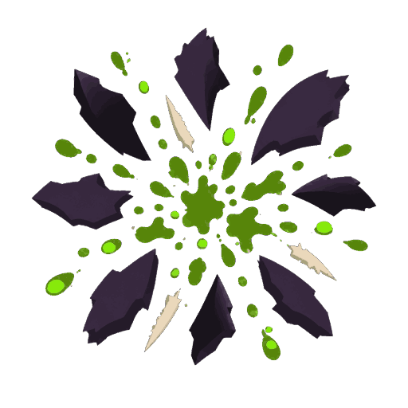

# Sprite: Bug death



- **Asset**: `public/assets/sprites/vfx/bug-death.png`, 512×512, RGBA, manifest id `vfx.bug-death`; sheet `vfx.bug-death-sheet` (384×256, 3×2 frames of 128).
- **Generator**: Codex CLI 0.152.1 built-in `image_gen` via `tools/art/gen-image.sh`, then `magick -strip +dither -colors 32 png32:` (58 KB, down from 147 KB with no visible change). Sheet from `tools/art/build-vfx-strips.sh`.
- **Date**: 2026-09-04
- **Prompt file**: [`prompts/bug-death.txt`](prompts/bug-death.txt)

## Prompt

```
Game VFX sprite on a fully transparent background (real alpha channel; do not paint a checkerboard, do not paint any background colour): an alien insect death burst seen from the front. Angular broken chitin plate fragments, eight to ten of them, flying outward from the centre, mixed with a splatter of thick bioluminescent ichor droplets of irregular sizes. Flat vector-style fills, hard edges, no shading or gradients inside shapes; colours: dark chitin #2B2436 and near-black chitin #14121A for the plate fragments, sickly green #4C8F1A for the ichor with bright bioluminescent green #9CFF3D highlights on a few droplets, two or three pale bone #D8CBB0 spine slivers. No creature, no body, no ground, no background elements. Square 512 by 512 pixels, the burst centred, no text, no watermark.
```

## Keep

- **Normal** blend, not additive: shards are dark and must stay dark over a light tile.
- Plays over the death fade (`TacticalAnimationQueue.fade`) for bug units only; TDF deaths keep the plain shrink until they get their own effect.
- Radial, no ground plane baked in, so it works at any of the four yaw stops.
- **Draw it at 1.0 tiles.** At 0.8 the dark chitin shards disappear against a dark tile and only the green ichor survives; the shards are half the read.

## Change next pass

- A TDF counterpart (sparks, scorched plate, no ichor) when TDF deaths get an effect.
