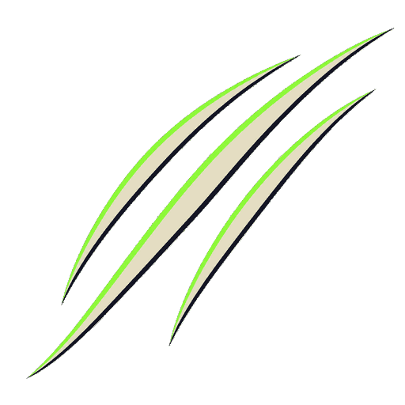

# Sprite: Claw slash



- **Asset**: `public/assets/sprites/vfx/claw-slash.png`, 512×512, RGBA, manifest id `vfx.claw-slash`; sheet `vfx.claw-slash-sheet` (256×256, 2×2 frames of 128).
- **Generator**: Codex CLI 0.152.1 built-in `image_gen` via `tools/art/gen-image.sh`, then `magick -strip +dither -colors 32 png32:` (39 KB). Sheet from `tools/art/build-vfx-strips.sh`.
- **Date**: 2026-09-04
- **Prompt file**: [`prompts/claw-slash.txt`](prompts/claw-slash.txt)

## Prompt

```
Game VFX sprite on a fully transparent background (real alpha channel; do not paint a checkerboard, do not paint any background colour): a single alien melee claw slash. Three parallel curved gashes sweeping in a crescent arc from the lower left to the upper right, each gash a tapered blade shape, widest in the middle and pointed at both ends, the middle gash the longest. Flat vector-style fills, hard edges, no shading or gradients inside shapes; colours: pale bone white core #D8CBB0, bioluminescent green #9CFF3D along the leading edge, near-black chitin #14121A outline on the trailing edge. No claw, no arm, no creature, no blood, no ground, no background elements. Square 512 by 512 pixels, the arc centred, no text, no watermark.
```

## Keep

- Three gashes, `bug-bone` core with a `bug-bio-green` leading edge — bug melee, never TDF. Every bug species is range 1 (`src/bugs/data/species.ts`), so this is the attack effect for **every** bug attack; the muzzle flash belongs to ranged attackers only.
- **Draw it at 0.9 tiles**, not the 0.7 the impact uses: at 0.7 the three gashes merge into a smudge at 64 px per tile, and a claw landing should feel bigger than a bullet.
- Sweeps lower-left → upper-right. Mirror on X for a strike from the other side rather than rotating 180°, or the gash tapers point the wrong way.

## Change next pass

- A heavier two-gash brute variant if the brute needs to read differently from a swarmer.
