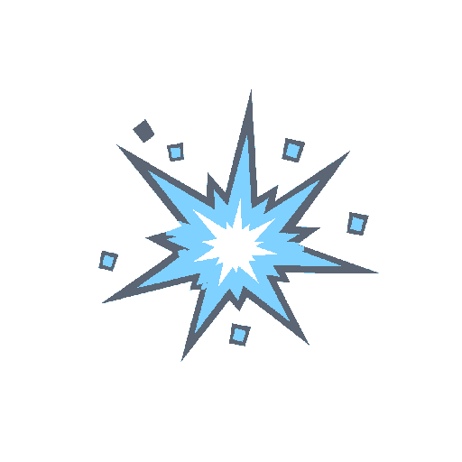

# Sprite: Bullet impact



- **Asset**: `public/assets/sprites/vfx/impact.png`, 512×512, RGBA, manifest id `vfx.impact` in `src/graphics/data/sprite-manifest.ts`.
- **Generator**: Codex CLI 0.152.1 built-in `image_gen` via `tools/art/gen-image.sh`, transparent background requested in the prompt.
- **Date**: 2026-09-02
- **Prompt file**: [`prompts/impact.txt`](prompts/impact.txt)

## Prompt

```
Game VFX sprite: a single bullet impact burst on hard chitin, seen from the front: a compact hard-edged spark burst with six to eight short straight rays and a few small square fragments flying outward, low-poly flat-shaded game style with three tone bands: white core #FFFFFF, light blue #7FD1FF, dim grey edge #5B6573. No surface, no gun, no smoke, no background elements. Transparent background PNG, the burst centred, square 512 by 512 pixels, no text, no watermark.
```

## Keep

- Compact spark burst with square fragments; white core, `tdf-visor` blue, `tdf-grey-mid` edge. Only 7 KB because the bands are flat. Additive blend.

## Change next pass

- Fragments could be chitin-coloured (`bug-chitin-mid`) for hits on bugs versus grey for hits on cover; consider two variants.
