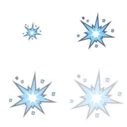
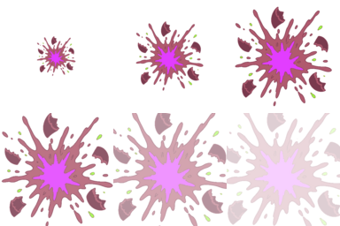

# VFX animation sheets

| | | |
|---|---|---|
|  |  |  |

- **Assets**: `public/assets/sprites/vfx/muzzle-flash-sheet.png`, `impact-sheet.png` (256², 2×2 frames), `egg-burst-sheet.png` (384×256, 3×2 frames); frames are 128 px, read left to right then top to bottom. Manifest ids `vfx.muzzle-flash-sheet`, `vfx.impact-sheet`, `vfx.egg-burst-sheet`; each entry's `sheet` field carries frame size, columns, rows, frame count and a suggested `frameMs`.
- **Source**: derived deterministically from the single sprites by `tools/art/build-vfx-strips.sh` (ImageMagick): scale and alpha per frame, no new generation, so the sheets always match the singles. Date: 2026-09-03 (#395).
- **Playback**: muzzle flash 4 × 40 ms additive at the `socket_muzzle` of the firing weapon, oriented along the shot; impact 4 × 50 ms additive at the hit point; egg burst 6 × 70 ms normal blend at the spawner's `socket_hatch`. The last frame of each sheet fades to about 25–45 % alpha, so ending on it needs no extra fade.

## Frames

| Sheet | Frames |
|---|---|
| muzzle flash | 55 % grow, 100 % peak, 100 % × 125 % wide tongue, 80 % at 45 % alpha |
| impact | 50 % spark, 100 % full, 125 % at 70 % (fragments spread), 140 % at 35 % |
| egg burst | 40 %, 70 %, 100 %, 115 % at 85 %, 125 % at 55 %, 135 % at 25 % |

## Change next pass

- Hand-drawn intermediate frames (a different silhouette per frame) if the scaled look reads as a zoom rather than a burst in motion; the manifest layout stays the same.
