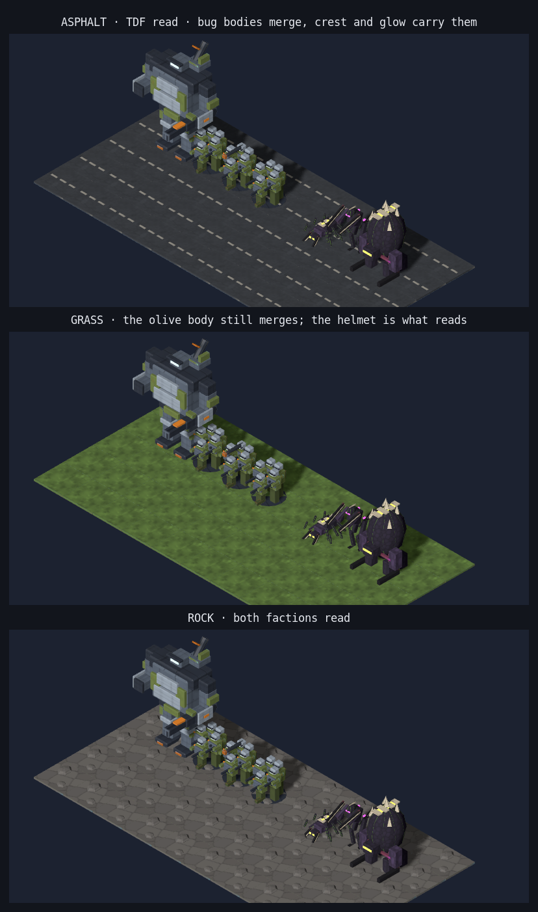
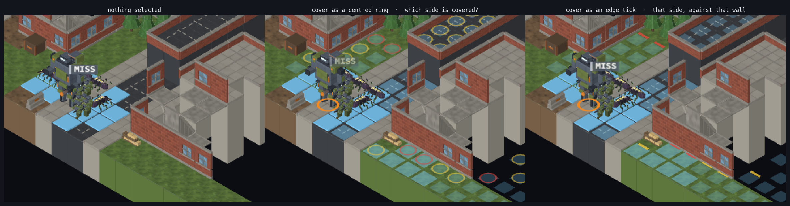
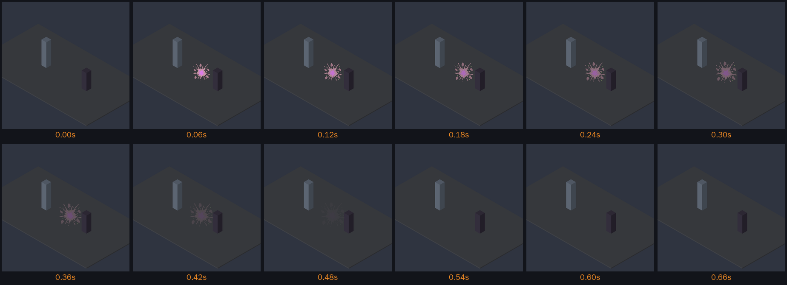
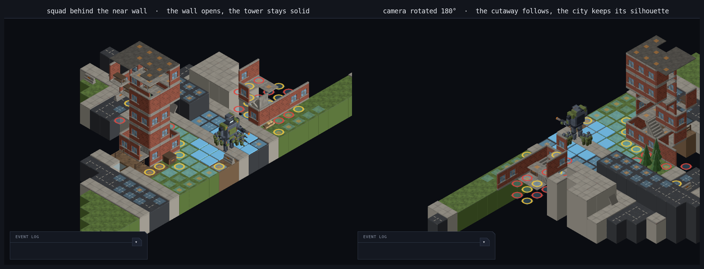
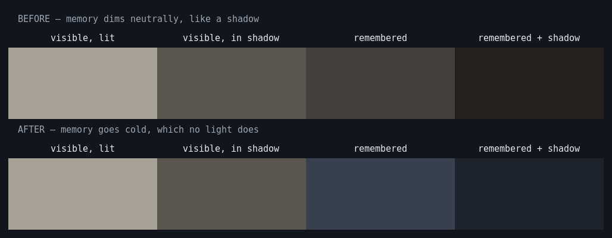

# Terra Under Threat — Art Style Guide

> Owner: Art Director. Palette and scale changes go through a PR on this file; anything that changes gameplay-relevant scale (tile size, floor height) needs Tech Lead sign-off. Manifest format (§8) is agreed with the Tech Lead.
>
> Companion docs: `gdd.md` §3 (setting and tone), §5.7 (roster), §6.1 (presentation), §6.4 (bugs); `architecture.md` §7 (assets).

## 1. Pillars

1. **Readable at isometric distance.** Every unit must be identifiable from its silhouette at the game's default zoom (about 64 px per tile). If it needs a texture to read, it fails.
2. **Two factions, two colour worlds.** TDF is cool grey, olive and orange. Bugs are near-black chitin with sickly bioluminescence. The two palettes never share a hue.
3. **Low-poly with intent.** Flat-shaded, hard-edged, chunky. Detail goes into silhouette and colour blocking, not surface noise.
4. **Modular by construction.** Mech parts, building kits and tile sets are assembled from pieces with shared pivots and sockets so map generation and the mech bay can recombine them.
5. **Military-procedural UI.** Flat, high contrast, monospace data, no ornament.

## 2. Camera facts that drive the art

These are the presentation assumptions the art is built against (GDD §6.1; the camera rig itself is Tech Lead territory).

| Fact | Value | Consequence for art |
|---|---|---|
| Projection | Orthographic | No perspective foreshortening; tall things do not shrink. Keep verticals clean. |
| Elevation angle | ~35° above horizontal (dimetric-ish) | Tops of objects are visible. Roofs and heads matter. |
| Yaw | 4 orientations, 90° steps | Every model must read from all four diagonals. No "back" side. |
| Default zoom | ~64 px per tile, range roughly 40–128 px | A 0.1 u detail is ~6 px. Anything smaller is noise. |
| Lighting | One key directional light + soft ambient, fixed | Bake no lighting into materials. Emissives carry the accents. |

```
            key light
              ╲
   ┌──────────────────────┐   camera at ~35° elevation,
   │  roof / head visible │   looking down the diagonal
   │ ┌────┐   ┌────┐      │
   │ │ N  │   │ E  │      │   the two visible side faces
   │ └────┘   └────┘      │   are equally important
   └──────────────────────┘
```

## 3. Scale and proportions

**1 tile = 1 world unit = 2 metres.** Everything below is in world units (u). Vertical levels from the map contract (ADR 0004) are one storey each, so one level = 1.5 u. Pivot is the centre of the base footprint at y = 0 (feet on the ground). +Y up, +Z forward, right-handed (glTF convention).

| Subject | Footprint (tiles) | Height (u) | Notes |
|---|---|---|---|
| Infantry figure | — | 0.9 | A person is 1.8 m. Five figures share one squad base. |
| Infantry squad token | 1×1 | 0.9 (figures) on a 0.05 thick base disc, Ø 0.85 | Figures arranged in a loose wedge; leader front-centre. |
| Mech (baseline chassis) | 1×1 | 2.4–2.8 | Taller than a building floor (1.5 u) so it visibly cannot enter interiors. Shoulders ~1.1 u wide. |
| Mech, heavy chassis | 1×1 | up to 3.2 | Same footprint. Never exceeds 1.4 u wide at the shoulders; must not clip neighbours. |
| Swarmer | 1×1 | 0.5 | Low wedge, ~0.8 u long. Cheap, many on screen. |
| Lurker | 1×1 | 1.3 | Tall, thin, forward-leaning. Blades longer than legs. |
| Brute | 1×1 | 1.8 | Wide dome, ~0.95 u across. Fills the tile. |
| Egg spawner | 1×1 | 1.4 | Fleshy mound with 3–5 eggs. A 2×2 "clutch" variant may come later. |
| Building floor | — | 1.5 | Floor-to-floor. Interiors are for infantry only. |
| Wall | — | 1.5 × 0.1 thick | Snaps to tile edges. |
| Low cover | ≤ 1×1 | 0.5 | Half cover. Sandbags, barriers, car hoods. |
| High cover | ≤ 1×1 | ≥ 1.0 | Full cover. Walls, dumpsters, pillars. |
| Terrain elevation step | — | 1.5 | One level = one storey (ADR 0004). A one-level ground step is a cliff unless a ramp tile spans it. |
| Door | — | 1.2 tall × 0.6 wide | Centred on a wall segment. |

```
 height (u)
 3.0 ┤                       ┌─┐
 2.5 ┤                       │M│  mech
 2.0 ┤             ┌───┐     │ │
 1.5 ┤  ── floor ──│ B │─────│ │──  ┌ ┐
 1.0 ┤        ╱╲   │   │     │ │    │E│ egg spawner
 0.5 ┤  ▲  ▲ ╱L ╲  │   │     │ │    │ │
 0.0 ┴──iii──S────────────────┴─┴───┴─┴──
      squad swarmer lurker brute mech
```

Silhouette rules per class:

- **Infantry squad**: a cluster of five upright sticks on a disc. Helmets are the biggest readable feature; one figure carries something long (rocket, sniper) to identify squad type.
- **Mech**: a tall rectangle with shoulders wider than hips, one arm ends in a weapon, one shoulder or back carries a second weapon. Legs are clearly separate pieces.
- **Swarmer**: a horizontal wedge, head low, back spines. Reads as an arrow pointing where it runs.
- **Lurker**: a vertical, forward-leaning stroke with two long blade arms held up. Thin waist. Reads as a question mark.
- **Brute**: a dome. Head sunk into the carapace, blade-hands dragging. Reads as a boulder.
- **Egg spawner**: a lumpy mound with three to five ovoid eggs, one split open. Reads as wrong.

## 4. Palette

Hex values are the single source of truth. Model materials, textures, sprites and CSS tokens all pull from here. Names are the material names inside GLB files and the CSS custom property names (prefixed `--`).

### 4.1 TDF

| Token | Hex | Use |
|---|---|---|
| `tdf-grey-dark` | `#2E3440` | Joints, undersides, weapon bodies |
| `tdf-grey-mid` | `#5B6573` | Primary mech armour |
| `tdf-grey-light` | `#9AA5B1` | Armour edge highlights, worn paint, **infantry helmets** (§4.2.1) |
| `tdf-olive` | `#6B7A3F` | Infantry uniform, mech secondary panels |
| `tdf-olive-dark` | `#45502A` | Infantry webbing, boots, olive shadows |
| `tdf-orange` | `#F08A24` | Unit markings, lights, weapon tips, selection ring. Also the UI accent. |
| `tdf-orange-dim` | `#B86414` | Orange in shadow, hazard stripes |
| `tdf-visor` | `#7FD1FF` | Visors, optics, mech cockpit glow (emissive) |

Rule: orange covers at most 10 % of any TDF model's visible surface. It is a marker, not a colour scheme.

### 4.2 Bugs

| Token | Hex | Use |
|---|---|---|
| `bug-chitin-black` | `#14121A` | Blade backs, claws, deepest plates |
| `bug-chitin-dark` | `#2B2436` | Primary body |
| `bug-chitin-mid` | `#4A3B5A` | Plate highlights, joints |
| `bug-flesh` | `#7A3A4E` | Exposed flesh between plates, egg mounds |
| `bug-flesh-light` | `#B05A6E` | Flesh highlights, egg membranes |
| `bug-bio-green` | `#9CFF3D` | Primary bioluminescence: eyes, vein lines, spines (emissive) |
| `bug-bio-green-dim` | `#4C8F1A` | Non-emissive green, sick residue, spawner pools |
| `bug-bio-magenta` | `#E23DFF` | Secondary bioluminescence: egg interiors, lurker markings (emissive) |
| `bug-bone` | `#D8CBB0` | Blade edges, teeth, spines |

Rule: bioluminescence is small and bright, never a wash. Swarmers get green only. Lurkers get magenta. Brutes get green with bone. Spawners get both, pulsing.

Rule: **`bug-bone` is what makes a bug readable, not the glow.** Dark chitin on dark asphalt is a silhouette with no edge, so every species carries a segmented bone crest along its spine — plates, not one slab, with the glow between them. The glow says *which* species; the crest is what says *there is something there* at 64 px per tile.

### 4.2.1 The read test



**Each faction has its own worst ground, and they are not the same ground.** The test used to be asphalt alone, described as "the darkest ground in the game and the worst case for either". It cannot be the worst case for either: the factions are different colours, so the ground that swallows one is the ground that shows off the other. Asphalt is where TDF read *best*, and testing there returned a clean bill of health for a faction that disappears on grass.

Run all three after any change to a unit, a bug or a ground token. The page lights with the game's rig, shadows included (§12.1) — a read test lit differently from the game is testing a fiction, and contact shadows are the one thing separating a shape from ground of its own tone:

```
node tools/art/preview/render-scene.mjs tools/art/preview/layouts/asphalt-read.json out.png
node tools/art/preview/render-scene.mjs tools/art/preview/layouts/grass-read.json   out.png
node tools/art/preview/render-scene.mjs tools/art/preview/layouts/rock-read.json    out.png
```

- **Asphalt** is the bugs' worst ground. Dark chitin on dark road: the bodies merge and only the bone crest and the glow carry them. TDF read comfortably here.
- **Grass** is TDF's worst ground, and it is the temperate biome's primary surface — the most common ground in the game. `tdf-olive #6B7A3F` against `env-grass #5E7A3A` is **ΔE 6.2, ΔL 1.0**: no tonal separation at all, and barely above the threshold at which two colours are the same colour. The olive torso and arms still merge with it and always will — that is what olive drab is *for*. What makes the squads findable is the helmet above them (#613).
- **Rock** is the control. Both factions read.

**Screen on value, not on colour distance** (#613). ΔE catches an outright duplicate like olive-on-grass, and is worth computing for any new colour — but on its own it will tell you a figure is fine when it is invisible. The infantry helmet was `tdf-grey-mid`: **ΔE 46 from grass and ΔL 5**. Hue distance carrying no tonal difference does not survive 64 px and a cast shadow, and the squads disappeared exactly as though the helmet were not there.

What actually keeps a figure visible is that **at least one of its parts separates in value from the ground it stands on.** By that measure the old infantry were tonally flat on *four* grounds — rock 3.7, frozen dirt 4.0, grass 5.3, dirt 6.1 — every part of the figure the same tone as the terrain. A light helmet takes the worst case to 9.6, and on the grounds where the helmet then matches the ground instead (sidewalk, wet sand) the olive body carries it. That two-part split is the TDF equivalent of the bugs' bone crest, and `faction-read.test.ts` guards both the ΔE screen and the value one.

ΔE also overstates the large models: it flagged `tdf-grey-mid` mech armour on rock at 12.3, which the render does not bear out, because the mech is big and internally contrasty. **Size and internal contrast beat any single hue distance.** A small, near-monotone model is the one in danger.

**There is no colour that separates from every ground**, so do not go looking for one. `tdf-grey-light` merely trades grass for concrete (ΔE 15.7). Separation has to come from something that is not hue: the bone crest on the bugs, and contact shadows (#507) for everything — a shape on ground of its own tone is separated by the shadow under it as much as by anything on its back. That is why the answer to "I cannot see the units" is not more glow, and not a new colour.

### 4.3 Environment by biome

Shared: `env-asphalt #3A3D42`, `env-concrete #8E8A82`, `env-sidewalk #A7A297`, `env-brick #8A4B3A`, `env-glass #6E8FA6`, `env-roof #55524C`, `env-metal #6F7378`, `env-rust #8C5A3A`, `env-rock #6E6A66`, `env-bark #5A4634`, `env-foliage #3F6B33`.

| Biome | Ground | Secondary | Accent |
|---|---|---|---|
| Temperate | `env-grass #5E7A3A` | `env-dirt #7A6045` | `env-foliage #3F6B33` |
| Snow | `env-snow #E8ECF0` | `env-ice #B9D2E0` | `env-frozen-dirt #6B6A66` |
| Desert | `env-sand #D9B87A` | `env-sandstone #B58A5A` | `env-scrub #8A8A4A` |
| Coastal | `env-wet-sand #B5A276` | `env-water-shallow #3F8FA8` | `env-water-deep #1F5C73`, `env-seawall #7E7F7A` |

Infested ground overlays use `bug-flesh` and `bug-bio-green-dim`; never recolour the base tile.

### 4.4 UI

| Token | Hex | Use |
|---|---|---|
| `ui-bg` | `#0B0D12` | Page and canvas clear colour |
| `ui-panel` | `#141821` | Panels |
| `ui-panel-raised` | `#1C2230` | Hovered rows, active tabs |
| `ui-line` | `#2E3646` | 1 px borders, dividers, grid lines |
| `ui-text` | `#E6E8EE` | Body text |
| `ui-text-dim` | `#8B94A6` | Labels, secondary text |
| `ui-accent` | `#F08A24` | Primary buttons, selection, focus. Same as `tdf-orange`. |
| `ui-info` | `#7FD1FF` | Intel, hover hit chance, links |
| `ui-ok` | `#7CCB5A` | Success, healthy, mission won |
| `ui-warn` | `#F0C63C` | Caution, low ammo, heat |
| `ui-danger` | `#E0453C` | Damage, loss, permadeath |
| `ui-bug` | `#9CFF3D` | Infestation and threat readouts. Same as `bug-bio-green`. |

Contrast: all text on `ui-panel` meets WCAG AA (`ui-text-dim` on `ui-panel` is 6.3:1).

## 5. UI style

Implementation: `src/ui/style/theme.css` exposes the §4.4 tokens as CSS custom properties (`--ui-*`) and provides the `.tut-*` components below (panel, button, label, data, table, badge, meter, top bar, icon). Icons are registered in `src/ui/data/icon-manifest.ts`. Preview: `docs/design/ui-theme-preview.png`, built from `tools/art/preview/ui-theme.html`.

- **Type**: labels and data in monospace: `ui-monospace, "JetBrains Mono", "Cascadia Mono", "SF Mono", Consolas, monospace`. Body copy in `system-ui, "Segoe UI", Roboto, sans-serif`. Labels are uppercase with `letter-spacing: 0.08em`.
- **Shapes**: rectangles with one 45° chamfered corner (top-right, 8 px) on panels and buttons. That chamfer is the signature; nothing else is rounded.
- **Lines**: 1 px `ui-line`. No shadows, no gradients, no blur.
- **States**: hover raises to `ui-panel-raised`; active/selected gets a 2 px `ui-accent` left bar; disabled drops text to `ui-text-dim` at 60 % opacity.
- **Checkboxes and radios** are styled on the element, not behind a class: 16 px, `ui-line` border on `ui-bg`, filled `ui-accent` with a drawn tick when checked, so a selected row reads from across the screen. A screen that writes a plain `<input type="checkbox">` gets the game's control, not the browser's white box — which is what the deployment picker was showing.
- **Numbers**: tabular figures, right-aligned. Percentages carry the sign (`+12 %`). Credits are prefixed `¢`.
- **In-world menus** are rings, not panels (ADR 0007). A decision that belongs to a thing on the map is shown at that thing: choices on an ellipse around it, the number the decision turns on at the centre, no box around any of it. Six choices is the most a ring holds. The ellipse is 1.75× wider than tall because labels grow sideways — a circular ring puts a wide entry straight through the middle. See [`radial-menu.png`](radial-menu.png).
- **Icons**: 16 and 24 px, single colour, 2 px stroke, SVG. Live under `public/assets/ui/icons/`. Two sets: overworld and shared chrome (#102), and the tactical HUD set (#466) — `end-turn`, `interact`, the `hidden` and `suppressed` statuses, and the stat glyphs `hp`, `ap`, `armor`, `damage`, `range`, `cover-low`, `cover-high`, `elevation`, `ammo`. `ap` deliberately shows two filled pips and one empty: spent against remaining.
- **Rows in a `.tut-list` are flex, and beat their own class.** `.tut-list > li` sets `display: flex; justify-content: space-between`, and that selector out-ranks a plain `.tut-thing__row`. Any row that wants columns has to say `.tut-list > li.tut-thing__row`, or its `grid-template-columns` is dead and never applies. The mission list carried such a rule unnoticed for months: a flex row sizes each cell to its own content, so no column lined up with the row above and the mission type ellipsised at a different point on every line (#683).
- **A CSS change that measures identical before and after has not been applied.** This caught me twice in one day — the side rail's `min-height: 0` (#674) and the row grid above — and both times the code looked obviously right. Before writing the explanation, read `getComputedStyle(el)` for the property in question and confirm it is what the rule asked for. `tools/art/preview/cssaudit.mjs` walks every stylesheet rule declaring a grid and reports any whose elements do not compute one; run it across the screens after a layout change. It is clean today apart from a closed modal, which is correct.
- **Voice**: military-procedural. `DEPLOYMENT AUTHORISED`, `CONTACT: 3 SWARMERS`, `MECH LOST — ATLAS-02`. Terse, uppercase for headers, sentence case for body.

## 6. Modelling and material conventions

- **Format**: glTF binary (`.glb`), one file per asset, no external buffers or images unless a texture is required.
- **Axes**: +Y up, +Z forward, right-handed. Bake all transforms; root node has identity transform. 1 unit = 1 tile.
- **Pivot**: centre of the base footprint at y = 0. Wall and edge pieces pivot on the tile edge they attach to (see §7).
- **Materials**: one `MeshStandardMaterial` per palette token, named exactly as the token (`tdf-grey-mid`). `metalness 0`, `roughness 0.9` for cloth and chitin, `0.6` for painted metal. Emissive tokens set `emissive` to the same hex with `emissiveIntensity 1.5`.
- **Shading**: flat. No smoothing groups on armour, tiles or buildings. Organic bug flesh may use smooth normals.
- **Textures**: three 512² palette atlases (`tdf-atlas_albedo`, `bug-atlas_albedo` for units; `env-atlas_albedo` for tiles, buildings and props), one 128 px cell per token, built by `tools/art/build-textures.mjs`; a face maps its whole UV range into the cell of its token, and the GLB references the atlas as an external image so files stay small. No per-model textures. Linear filtered with mipmaps; nearest-neighbour only for pixel-locked detail. Sprites ≤ 512².
- **Sockets**: empty nodes named `socket_<name>` mark attach points. Mechs expose `socket_arm_l`, `socket_arm_r`, `socket_back`, `socket_legs`. Buildings expose `socket_door`, `socket_roof`. Spawners expose `socket_hatch` for the egg-burst VFX.
- **Mech part nodes**: a mech is assembled at runtime from separate GLBs: `chassis`, `legs`, `arm-l`, `arm-r`, `weapon-arm`, `weapon-back`. Each part pivots at its socket point so the mech bay can swap them.
- **No lights, no cameras, no animations** in GLBs for now. Animation is a later track; when it comes it will be node-transform clips, not skinning, for everything except infantry.

### Poly and file budgets

| Asset class | Triangle budget | File size |
|---|---|---|
| Infantry figure | 150–300 (squad ≤ 1 500) | ≤ 100 KB |
| Mech chassis / legs / arm / weapon | 1 200 / 800 / 400 / 300 | ≤ 150 KB per part |
| Swarmer / lurker / brute | 600 / 1 000 / 2 000 | ≤ 100 KB |
| Egg spawner | 1 200 | ≤ 100 KB |
| Tile piece (ground, road) | ≤ 60 | ≤ 20 KB |
| Building module (wall, floor, roof, stairs) | ≤ 800 | ≤ 100 KB |
| Prop (cover, street furniture) | ≤ 300 | ≤ 60 KB |

Hard cap from the role brief: models < 500 KB, textures ≤ 1024², sprites ≤ 512². One documented exception: the overworld world-map texture is 2048×1024 (a 2:1 plate carrée needs the width for coastlines at map zoom); it is the only texture allowed over 1024² and must stay under 1.5 MB.

## 7. Tile and building kit conventions

Map generation assembles maps from these pieces (GDD §7, architecture §5 map contract).

- **Ground tiles** are 1×1 u, 0.05 u thick slabs, pivot at centre. Variants: `<biome>-ground-a/b/c`, `city-road-straight`, `city-road-corner`, `city-road-cross`, `city-road-t`, `city-sidewalk`, `city-sidewalk-corner`.
- **Walls** are 1 u long, 1.5 u tall, 0.1 u thick, pivot at the wall's base midpoint, running along local +X. Placed on tile edges. Variants: `wall`, `wall-window`, `wall-door` (door 1.2 × 0.6 opening), `wall-half` (0.5 u high, low cover).
- **Floors** are 1×1 u slabs at y = 0 of their level; **stairs** occupy one tile and rise 1.5 u along local +Z; **ramps** are outdoor stairs' terrain cousin, same rise, biome-textured; **roofs** are 1×1 caps with a 0.1 u parapet.
- **Props** are ≤ 1×1, pivot at base centre: `barrier-concrete`, `sandbags`, `dumpster`, `car-sedan` (2×1, pivot at centre of the 2-tile footprint), `lamp-post`, `hydrant`.
- Every kit ships a doc listing pieces, footprints and which edge they snap to. The city building kit is [`kits/city-building-kit.md`](kits/city-building-kit.md) and the props are [`kits/cover-props.md`](kits/cover-props.md).

**Tile texture rule (#441).** A tile's whole top face samples one 128 px atlas cell, and there is one model per tile id, so every grass tile in a field is the same stamp. Detail therefore lives at **mid scale** — value noise of period 6–11 and blobs 4–13 px across, plus fine grain — never one tile-sized feature, which turns a field into visible repetition. Aim for a luminance standard deviation of **7–15 per cell** (`env-sidewalk` 15.6 and `env-rock` 9.9 are the reference points); below about 5 the surface reads as flat colour at 64 px per tile. Keep the cell's mean on its palette hex (§4): contrast comes from the multipliers around it, not from a new colour.

### Mapgen ids → models

Map generation (`src/mapgen/data/surfaces.ts`, `props.ts`) emits surface ids and prop kinds; graphics resolves them to models with this table. Placeholder ids come from `tools/art/placeholders.manifest.json`.

| Surface id | Model id | Note |
|---|---|---|
| `grass` / `dirt` / `sand` / `snow` / `rock` | `tile.ground.<id>` | 1×1 slabs; rock has lumps |
| `road` | `tile.city.road-straight` | Graphics picks `-corner`, `-t`, `-cross` by road neighbours |
| `sidewalk` | `tile.city.sidewalk` | `-corner` by neighbours |
| `water` | `tile.ground.water` | Recessed 0.02 u below ground |
| `floor` | `building.floor` | Interior |
| `roof` | `building.roof` | Plus `building.roof-parapet` on outer edges |
| `stairs` | `building.stairs` | Rises along local +Z |

| Prop kind | Model id | Cover in mapgen |
|---|---|---|
| `car` | `prop.car-compact` (1×1). `prop.car-sedan` is 2×1 for hand-placed wrecks | high |
| `crate` | `prop.crate` | low |
| `barrier` | `prop.barrier-concrete` | low |
| `sandbags` | `prop.sandbags` | low |
| `dumpster` | `prop.dumpster` | high |
| `shelving` | `prop.shelving` | high |
| `fence` | `prop.fence` | low |
| `boulder` | `prop.boulder` | high |
| `tree-pine` / `tree-oak` / `tree-palm` | `prop.tree-<id>` | high |
| `cactus` | `prop.cactus` | high |
| `table` | `prop.table` | low (interior) |

Walls are `Wall` records on tile edges, not props: `building.wall`, `building.wall-window`, `building.wall-door`, `building.wall-half` by wall kind.

Full-height walls ship in **three material families** — brick, concrete and panel — with identical geometry and different palette tokens (`building.wall{,-concrete,-panel}` and the `-window`/`-door` variants of each). One family per building, chosen by hashing the tile'"'"'s `buildingId`; walls with no building stay brick. The table and the reasoning are in [`kits/city-building-kit.md`](kits/city-building-kit.md).

### Part catalogue → models

The roster's starter part catalogue (`src/roster/data/parts.ts`) maps to mech part models like this; the mech bay assembles them at the sockets in §6. Utilities have no visual slot.

| Part id | Model id |
|---|---|
| `chassis-vanguard` | `tdf.mech.chassis-a` |
| `chassis-bulwark` | `tdf.mech.chassis.bulwark` |
| `chassis-atlas` | `tdf.mech.chassis.atlas` |
| `legs-strider` | `tdf.mech.legs-a` |
| `legs-bastion` | `tdf.mech.legs.bastion` |
| `legs-jumper` | `tdf.mech.legs.jumper` |
| `arms-tracker` | `tdf.mech.arm-l-a` + `tdf.mech.arm-r-a` |
| `arms-manipulator` | `tdf.mech.arms.manipulator-l` + `-r` |
| `arms-brace` | `tdf.mech.arms.brace-l` + `-r` |
| `arm-weapon-autocannon` / `-flamer` / `-laser` / `-railgun` | `tdf.mech.weapon-arm.autocannon` / `.flamer` / `.laser` / `.railgun` |
| `back-weapon-missile-pod` / `-mortar` / `-rotary-cannon` | `tdf.mech.weapon-back.missile-pod` / `.mortar` / `.rotary-cannon` |
| `utility-*` | none |

Reference assemblies: `tdf.mech.assembled-a` (Vanguard, Strider, Tracker, Autocannon, Missile Pod) and `tdf.mech.assembled-b` (Bulwark, Bastion, Brace, Railgun, Mortar).

## 8. Asset manifests

Shipped in #10; this section describes what exists. Ids and registries are split so simulation data can name a model without importing the renderer (architecture §3, ADR 0002).

| File | Holds |
|---|---|
| `src/content/data/model-ids.ts` | `MODEL_IDS` const array of dot-separated `faction.subject.variant` ids; `ModelAssetId` is its union. Declare the id here first. |
| `src/graphics/model/asset-manifest.ts` | `ModelAssetEntry { category, path, footprint {w,d}, height, sockets, quality }` and `ModelManifest = Readonly<Record<ModelAssetId, ModelAssetEntry>>`. The key carries the id; entries have no `id` field. |
| `src/graphics/data/model-manifest.ts` | `MODEL_MANIFEST`, typed against `ModelManifest`, so an id without an entry or a misspelt field fails typecheck. |
| `src/graphics/data/model-manifest.test.ts` | Every id registered exactly once; paths inside their category folder; GLB present and < 500 KB; sane footprints and `socket_*` names; entry-for-entry equality with `tools/art/placeholders.manifest.json`; no other file under `src/` may spell `assets/models/`. |
| `src/graphics/service/gltf-model-loader.ts` | Loads by id, prefixes Vite's `BASE_URL`, caches, falls back to `placeholder-model-factory.ts` primitives. External images referenced by a GLB (the unit atlases, §6) resolve relative to the GLB URL. |

Adding a model: add it to `MODEL_DEFS` in `tools/art/build-placeholders.mjs` (or drop a final GLB into the category folder), run `pnpm art:placeholders`, add the id to `MODEL_IDS`, add the entry to `MODEL_MANIFEST` copied from the JSON record, run `pnpm test`.

Sprites, textures and icons use the lighter self-keyed shape, since nothing in simulation references them:

```ts
export const SPRITE_MANIFEST = { "vfx.muzzle-flash": { path, size, blend, label } } as const satisfies Record<string, SpriteAssetEntry>;
export type SpriteId = keyof typeof SPRITE_MANIFEST;
export function spriteUrl(id: SpriteId): string { return `${import.meta.env.BASE_URL}${SPRITE_MANIFEST[id].path}`; }
```

`sprite-manifest.ts` and `texture-manifest.ts` live in `src/graphics/data/`; `icon-manifest.ts` lives in `src/ui/data/` because icons are DOM assets. Each has a test that parses the PNG or SVG header to pin size, alpha and byte budget.

## 9. File naming and locations

| Kind | Location | Pattern | Example |
|---|---|---|---|
| Model | `public/assets/models/<category>/` | `<faction-or-kit>-<subject>[-<variant>].glb` | `units/tdf-infantry-rifle.glb`, `bugs/bug-lurker.glb`, `tiles/city-road-corner.glb` |
| Texture | `public/assets/textures/<category>/` | `<subject>_<map>.png` | `tiles/city-atlas_albedo.png` |
| VFX sprite | `public/assets/sprites/vfx/` | `<effect>[-<variant>].png` | `muzzle-flash-a.png`, `egg-burst.png` |
| UI icon | `public/assets/ui/icons/` | `<name>.svg` | `overwatch.svg` |
| Concept art | `docs/design/concepts/` | `<subject>.png` + `<subject>.md` | `bug-brute.png`, `bug-brute.md` |
| Build scripts | `tools/art/` | `<verb>-<noun>.mjs` | `build-placeholders.mjs` |

All names kebab-case. Faction prefixes: `tdf-`, `bug-`. Kit prefixes: `city-`, `temperate-`, `snow-`, `desert-`, `coastal-`.

## 10. Generated image recipe

Concept art, textures and sprites come from the Codex CLI image generator. Every committed image has a sidecar `.md` with the exact prompt, model, date and keep/change notes (architecture §7).

Prompt skeleton, always in this order:

```
<subject and pose>, <faction palette by name and hex>, low-poly game model style,
flat shading, hard edges, isometric three-quarter view from 35° above,
plain neutral grey background, no text, no watermark, concept sheet with front,
side and three-quarter views
```

Palette hexes go in the prompt verbatim. Ask for "concept sheet with three views" for units and "seamless top-down tile" for ground textures. Sprites are requested on solid black for additive blending or transparent PNG when supported.

## 11. Checklist for any new asset

- [ ] Reads from all four yaw angles at 64 px per tile.
- [ ] Uses only palette tokens; materials named after tokens.
- [ ] Within triangle and file budgets (§6).
- [ ] Pivot, axes and sockets per §6/§7.
- [ ] Registered in the manifest (§8).
- [ ] Concept image, if any, has a prompt sidecar.

## 12. Tactical scene presentation

What a mission looks like once the models, textures and sprites are in the scene. Numbers here are the ones the code actually uses, so this section is a description of the shipped look, not a wish: `src/graphics/service/scene-service.ts` (lights), `tactical-overlays.ts` (overlays), `tactical-animation-queue.ts` (VFX), `unit-mesh.ts` (selection).

### 12.1 Lighting

One key and one fill, fixed — the camera rotates, the lights do not, so a given face always shades the same way and a player learns the read.

| Light | Colour | Intensity | Position |
|---|---|---|---|
| Key, directional | white | 2.5 | `(4, 8, 12)` |
| Ambient | white | 0.8 | — |

The key is deliberately off-axis from all four yaw stops (§2): at every stop the two visible faces of a box shade differently, which is what gives a flat-shaded low-poly model its form. Clear colour is `ui-bg #0B0D12`.

**The tactical scene casts shadows** (#507, shipped in #634). This section used to record "no shadow maps" as a deliberate choice, on the grounds that a cast shadow costs more than it says at 64 px per tile. That was decided before #505 put real buildings on the map, and it did not survive them: with nothing casting, a five-storey tower and a crate met the pavement the same way, and the height the city had just gained was invisible.

| Light | Intensity | Position |
|---|---|---|
| Key, directional, casting | 2.9 | `(4, 8, 12)` from whatever it lights |
| Ambient | 0.55 | — |

**The fill drop is half the effect.** At 0.8 the fill washes every shadow into a grey smudge and the shadow map buys nothing for its milliseconds. Take the shadow map without the fill drop and it will not look like the render.

Numbers live in `src/graphics/service/shadow-rig.ts`. Three things worth knowing before changing them:

- **The frustum follows the view, not the map.** A `DirectionalLight` shadows only what its orthographic frustum covers, and that frustum is centred on the light's target — left at the origin it sits on the corner of a 40 × 40 map and shadows nothing the player is looking at. `followCamera` moves the light and its target together, so the direction never changes and the fixed-rig promise above holds.
- **Cast and receive flags are set once, when the object is built**, on the map and the units — never by a traverse inside the render loop. Overlays and unit rings are deliberately left out: a move-range quad that cast a shadow would draw a second, offset copy of itself on the floor.
- **The filter is `PCFShadowMap`.** three r185 deprecated `PCFSoftShadowMap`; asking for it silently gets this and warns once per scene, so the soft edge you think you specified is not the one running. `VSMShadowMap` is the remaining soft option and is a real change, not a one-word swap.

The map is 1024², not 2048²: at this zoom it reads the same, and 2048 took the end-to-end suite from about 30 s to a minute and a half on software SwiftShader, timing two specs out.

Consequence for models: **do not bake light into a texture.** An atlas cell that already has a top-left highlight fights the key light at two of the four yaw stops.

### 12.2 Tile overlays

Overlays are instanced quads lifted one ground-slab thickness (0.05 u) above the tile top. It used to be 0.02, which sat *inside* the slab once #474 put the real tile models in, and every overlay was depth-tested away. They carry meaning by palette token, in one escalating order — information, caution, danger:

| Overlay | Token | Hex | Footprint | Means |
|---|---|---|---|---|
| Move range, 1 AP | `ui-info` | `#7FD1FF` at 0.45 | **fill**, 0.84 | One action gets you here |
| Move range, 2 AP | `ui-info` | `#7FD1FF` at 0.24 | **fill**, 0.66 | This one costs both actions |
| Low cover | `ui-warn` | `#F0C63C` at 0.8 | **tick on that edge**, 0.60 × 0.14 | Partial protection on that side |
| High cover | `ui-danger` | `#E0453C` at 0.8 | **tick on that edge**, 0.60 × 0.14 | Full protection on that side |
| Blocked shot | `ui-danger` | `#E0453C` at 0.9 | **diamond**, 0.26 | This tile will refuse the shot |
| Weapon range | `ui-accent` | `#F08A24` at 0.9 | **one boundary line**, 0.09 wide | How far this unit can shoot |
| Selected unit ring | `ui-accent` | `#F08A24` | **ring** 0.40–0.50, drawn through geometry | Who is acting |

Orange is the player's own intent, blue is possibility, yellow and red are the world pushing back. Nothing else on the tactical plane may use these four colours.

**Weapon range is a line, movement is a fill** (#522). Both bands of the move range are filled quads and mean "you can stand here"; the weapon envelope is drawn only along its edge and means "this far". Keeping them on different visual channels is what stops the range reading as a third movement band — the two never compete even where they overlap, which is most of the time. **Shown while Attack is armed**, with `v` to pin it up permanently (#590).

**The two move bands are one token at two opacities, never two hues** (#521, retuned in #566). Move range gets one colour, and the separation stays in value and footprint — a hue split is the one deuteranopia and protanopia lose.

The second band was first authored as a *darkened* `ui-info` (`#4C7D99`). That failed on contact with the map: QA measured the blend at `80,112,128`, which is shadowed ground, and the band vanished into shade. **Darkening a tint to mean "less" does not work on terrain that is already dark in places** — the shadow gets there first. Both bands are now the same token at different strengths, so every blend comes out *lighter* than whatever it covers. The dearer band is also inset to 0.66 of a tile, so the boundary is a change of shape as well as of tone and needs no legend.

**Neither move band fills its tile** (#569). At 0.92 a run of near-band tiles merged into one flat sheet of colour, which is how terrain is drawn — and players read it as a pond, the water surface being `env-water-shallow #3F8FA8`. Inset to 0.84 the ground shows through between neighbours, so the same tiles read as *marked* rather than *repainted*: a continuous surface is terrain, separated squares are the overlay. That distinction survives any tone.

**Weapon range is pips, not a fill** (#522, retuned in #566). An outline along the envelope's edge is thin on open ground and solid in a city, where line of sight cuts the envelope into pockets and almost every tile counts as edge; at 0.96 of a tile that buried the movement band under it. A small centred pip carries the same information for a tenth of the ink.

**A mark at full opacity is not automatically the boldest** (#605). three.js sorts a material with `transparent: false` into the *opaque* pass; paired with `depthWrite: false` — which every flat ground mark needs, so it does not occlude what stands on it — that means it writes no depth and everything drawn afterwards paints straight over it. The selection ring spent every build to date in the scene graph, visible, at the right height, and absent from the screen for exactly this reason. The hover ring escaped only by accident, its 0.6 opacity putting it in the transparent pass. **Every ground mark is `transparent: true`, `depthWrite: false`, with an explicit `renderOrder`** — tile overlays take 1 through 4, unit rings sit above them.

The selection ring alone also drops `depthTest`, so it reads through whatever stands in front of it. Units deploy shoulder to shoulder, and a depth-tested ring under a squad beside a 2.79 u mech is a sliver of orange — no answer to *which one am I commanding?*. It gives nothing away, because only the player's own units can be selected and their own units are always drawn. **Hover must not do this**: it lands on enemies too, and a ring through a wall would reveal a bug that vision is hiding (ADR 0006).

**One channel per question, and the channel is the shape** (#624). Four planes drawn as flat marks stamped per tile, in three tokens, at similar sizes, tell the player nothing about *which question* a mark answers. Colour says only how loudly the world is pushing back; the shape says what is being asked:

| Question | Shape | Why that shape |
|---|---|---|
| Where can I go? | Filled tiles | The only plane legitimately per-tile — the answer genuinely differs tile by tile. A fill means *you may stand here*. |
| How far can I shoot? | One continuous line | One fact, so one shape. A line means *this far*, and cannot be misread as somewhere to stand. |
| Who am I commanding? | A ring on the unit | Belongs to the unit, not the ground. Exactly one on screen, ever. |
| What does this tile give me? | A tick on the covered edge | Cover is *directional*. The mark sits against the wall that earns it, so it says **which side**, and reads as part of that wall rather than as a target on the tile. |
| Will this tile refuse the shot? | A diamond | Drawn by nothing else, so it never reads as cover or as range. |

After #624 exactly one ring shape is on the board at a time that belongs to a unit, and it is the selection. Three ring styles used to compete with no way to tell them apart.



**Put a mark on the thing it is about** (#624). Cover was drawn as a ring in the middle of the tile, which says *there is cover here* and then refuses to say where — although the rules always knew: `coverAgainst` is asked about all four sides and the four answers were collapsed to their maximum before drawing. A tick against the covered edge gives the direction back, and a corner covered on two sides now reads as a corner.

It also settled an argument this section had with itself twice. Cover opacity went 0.85 → 0.55 → 0.8. The ring at 0.85 read as a call to action; at 0.55 as a tick it disappeared. **A mark's weight in the hierarchy comes from what it is attached to, not from its alpha** — a bar lying against a wall reads as part of that wall however solid it is, and a circle floating in the middle of a tile reads as a target however faint. Total ink barely moved between the two (3.68 % of the plate against 3.54 %); what changed is where the ink sits.

**Mark the exception, not the rule** (#624). The sight cue marked every reachable tile with a line to any living enemy. With nine bugs on a city map that was **93 marks on 93 reachable tiles** — an indicator true everywhere has stopped being an indicator; it is a light that is always on. It now needs a target chosen, and marks the tiles that will *refuse* the shot, which is both rare and the thing a player standing in front of a silent refusal actually needs (#517).

This is the trap that catches an overlay whose premise was measured once: #590 gave sight *more* weight than cover on the grounds that it was "drawn on far fewer tiles", measured against fixtures where no enemy was visible and the count was zero. **Measure an overlay at its worst spread, not its typical one.**

**A boundary states reach, not permission.** Weapon range is deliberately *not* filtered by line of sight, and is laid flat at the firer's own level. Filtering by sight cut the envelope into pockets whose outline drew as disconnected dashes; following the terrain made the line climb the side of every building, and made its shape a picture of ground the player may never have seen, drawn on top of the fog that exists to hide it. Whether one tile will take the shot is the blocked-shot question, asked of a chosen target.

**Count the marks, not just tune them** (#590). Every rule above was argued and measured on its own overlay, and each one was right on its own. Together they put **71–171 instances** on the map for a single click — the planes were never budgeted against each other, only against the ground. The frame stopped reading as a city and started reading as an instrument panel, and the unit the player had just selected was the quietest thing in it.

Two rules come out of that, and they bind any overlay added later:

1. **An overlay belongs to the question being asked, not to the selection.** Movement is what selecting a unit asks, so the bands are the default plane. "How far do I shoot?" is asked while aiming, so the envelope follows armed intent and nothing else. A plane that is on for every selection needs to earn it against every other plane that is already on. Weapon range was on by default and had a key with no button, so 55–71 marks were both unavoidable and undiscoverable; gating it cut plain selection from 71–171 marks to 0–113.
2. **Weight tracks whether a mark is an instruction or an attribute.** Cover was the heaviest value in the file, 0.85, in its two most saturated tokens — which reads as *go here*, when cover is a property of a tile the player may never care about. Attributes sit below the unit in the hierarchy. Reach for alpha rather than for value when quietening one: on a map with shadow in it, value is the channel shadow gets to first (see the band above).

Line of sight keeps more weight than cover at 0.75, because it is drawn on far fewer tiles and it is a *threat* — an enemy can see you standing there — which is the one thing on this plane entitled to interrupt.

Values live in `src/graphics/data/tactical-overlay-palette.ts`; restyle them there, not at the call site. Sizes live there too, for the same reason a colour does. `tactical-overlay-palette.test.ts` guards the relationships: both bands the same token, the dearer one weaker and smaller, the range pip smaller than either.

### 12.3 VFX

Every effect anchors off the **unit's height**, never a fixed lift above its feet. That was the bug behind playtest 1's "no hit indication, and the damage numbers are inside the models" (#514): a flat 0.6 u lift is chest-high on an infantry figure and knee-high on a 2.79 u mech, so the flash, the spark and the number all played inside the model they belonged to.

```
       ── text          height + 0.25   never inside the model
  ┌───┐
  │ o │── muzzle        height × 0.65
  │/|\│── impact, slash height × 0.55
  │ | │── death burst   height × 0.50
  └───┘── feet          0
```

| Effect | Sprite | Blend | Size (tiles) | When |
|---|---|---|---|---|
| Muzzle flash | `vfx.muzzle-flash` | additive | 0.8, offset 0.35 toward the target | 0 – 0.12 s |
| Tracer | `vfx.tracer` | additive | 0.22 thick, turned along the shot | 0.06 – 0.24 s |
| Impact | `vfx.impact` | additive | 0.7 | on arrival, 0.15 s |
| Claw slash | `vfx.claw-slash` | additive | 0.9, replaces the flash at range 1 | 0 – 0.2 s |
| Damage / miss chip | canvas plate | normal | 1.3 wide | on arrival, rises 1.0 over 0.9 s |
| Death burst | `vfx.bug-death` / `vfx.tdf-death` | normal | 1.0 | over the 0.5 s fade |

**An attack is a sequence, not a blink.** Flash, then a tracer crossing to the target, then the impact, then the number: about 0.4 s to land. Playing them together in 0.35 s is what made the first build read as though nothing had happened.

**Additive is energy, normal is matter.** A muzzle flash, a tracer, a spark and a bioluminescent slash are light and must brighten whatever is behind them; chitin shards, torn plate and ichor are objects and must stay dark over a light tile. Getting this backwards is the most common way a VFX sprite looks wrong in the scene.

**Combat text is a chip, not tinted text.** A dark `ui-panel` plate, a `ui-line` border and a bar in `ui-danger` (damage) or `ui-text-dim` (miss), white monospace on top — the HUD's own language. Plain coloured text was unreadable over half the surfaces in the game: white on snow, red on brick. Effects draw with `depthTest` off and a high `renderOrder`, so nothing is hidden by the unit it describes.

**The egg burst plays when charges finish a spawner** (#697). Destroying spawners *is* the clearance mission — `0 / 2 Destroy spawner` is the objective panel — and until that issue the moment the whole mission is about resolved with nothing on screen, while the sprite sat in the manifest preloaded and undrawn. It is the largest effect in the set at 1.6 tiles against a unit death's 1.0, because it is the one the player came for, and it swells as it fades so it reads as a burst rather than a sprite being turned down. A hit that does *not* finish the spawner plays nothing extra: the attack sequence has already shown the strike, and a second effect on every hit would say it died when it did not.



Judge any change to these with the harness rather than by playing to contact — that takes twenty turns and still misses the 0.12 s frames:

```
node tools/art/preview/shoot-vfx.mjs out.png ranged   # or melee, death, burst
```

It runs the real animation queue against stand-in units at exactly 64 px per tile and steps it 0.06 s at a time, so the filmstrip is reproducible.

### 12.4 Building ghosting



XCOM-style ghosting (#526): geometry between the camera and a unit fades in a soft radius so the player never loses the fight behind a wall.

**It is a hole in the wall, not a see-through building.** A fragment fades where it is *both* within the radius of a unit *and* nearer the camera than that unit. Distance alone opens the wall behind the unit as well as the one in front, which reads as a spotlight rather than a cutaway; the depth test is what makes it XCOM's effect.

The building stays a solid object and the city keeps its silhouette. That is the point, and it is the half a mock cannot tell you:

> **Ghosting specs are only valid measured in a populated city block.** This section twice carried numbers taken from an isolated building on a bare plaza, and both times they were wrong on contact with a real map. First the fade floor and radius — 0.25 alpha over 2.5 tiles dissolved most of the building. Then the *technique*: `tactical-ghosting-target.png` specified a translucent tinted shell, which is attractive with one building on an empty slab and deletes the city's silhouette once every unit standing behind something dissolves a block. #581 implemented the cutaway instead, against the acceptance criteria and against the Executive Director's own words — "sorta a circle around units obscured" is a circle around the unit, not a dissolved building. The cutaway is the spec; the old target render is withdrawn.

Judge a change to this by shooting a mission and rotating, not by rendering one building:

```
node tools/art/preview/shoot-mission.mjs out.png 4242      # then Q / E to rotate
```

The case to check is a squad directly behind a near wall with a taller block behind it — the situation playtest 1 complained about. The plate above is that case at two yaws 180° apart.

| Property | Value | Why |
|---|---|---|
| Fade target | **0.35 alpha**, never 0 | The wall has to stay legible as a wall; cover the player cannot see is cover they will forget. At 0.25 the brick nearly disappears. |
| Radius | **2.0 tiles** around the unit | Enough for the unit's tile and its neighbours. Wider and too much of the city dissolves at once. |
| Soft edge | **0.65 tiles**, measured inward from the radius | A hard circle reads as a stencil; a soft one reads as the building giving way. Measured inward rather than as a fraction of the radius, so softness does not change when the radius does. |
| Fade in / out | **0.15 s** | Instant flickers as units move; longer lags the camera. |
| What fades | Walls, floors, roofs, parapets and tall props between the camera and the unit | Anything that can stand in the way. |
| What never fades | Ground, the unit itself, overlays, VFX, hook markers | These are the read. |

Applies to **every unit the player can currently see**, not only their own: hiding a spotted bug behind a wall undoes the spotting. That is the same question fog of war answers (#531), so it wants one predicate, not two.

The numbers above are the second pass. The first were 0.25 alpha over a 2.5-tile radius, which the mock showed dissolving most of the building — the point of mocking a look before building it.

### 12.5 How the systems compose

Fog of war, cast shadows, building ghosting and the overlay planes all
landed within one build. Each is right on its own; what matters at this
point is what they do to each other, because **the player sees the
composite and never the parts**.

The rule from §12.2 applies across systems, not just within one:
**one channel per question.** A system that darkens the ground is
answering "how lit is this?"; a system that darkens the ground is
answering "can I see this?" — and they cannot both be right.



| State | Multiplier | Means |
|---|---|---|
| Visible, lit | 1.00 | — |
| Visible, in shadow | ~0.54, measured on concrete | Something is between this and the sun |
| Remembered | 0.40 weight, **cold** | **You cannot see this any more** |
| Remembered, in shadow | ~0.22, cold | Both |

Memory used to be a **neutral** multiply, which is precisely what
lighting does — so the two middle states sat 1.35× apart on one channel
and darkness stopped meaning one thing.

**Lighting can darken a surface and warm or cool it a little; what it
never does is take the colour out.** So memory takes that channel
instead: `Color(0.34, 0.40, 0.52)`, the same overall weight with a cold
cast no light in the scene produces (#661). Fog recedes exactly as far
as it did — a remembered tile's luminance is unchanged to within a
third of a point — and it now sits a mean **ΔE 12.0** from the same
tile in shadow, against 7.4 before.

Dark and neutral is shadow. Dark and cold is memory. The shadow tone is
left alone: §12.1 sets it deliberately and it is doing that job.

Two more that were *checked and are not problems*, recorded so nobody
re-opens them on a hunch:

- **Ghosting against shadows.** A cutaway opens a wall and the roofed
  interior behind it is dark, which looks like the two fighting. Measured
  on the same seed, unit and yaw either side of shadows landing, the
  interior is **10 % darker** — it was already dark, because a roof
  blocks the key by geometry. Not the shadow map's doing.
- **Overlays in shadow.** The overlay planes are unlit `MeshBasicMaterial`
  and stay out of the shadow pass (§12.2), so a move band inside a
  shadowed building reads at full strength. That is deliberate: the
  overlays are instrument, not world, and an instrument that dimmed when
  a cloud went over would be worse.

### 12.6 What still has no art

- No suppression, overwatch-trigger or reload effect.
- No decals: scorch marks, blood pools and rubble are geometry-free today, so a fought-over tile looks the same as an untouched one.
