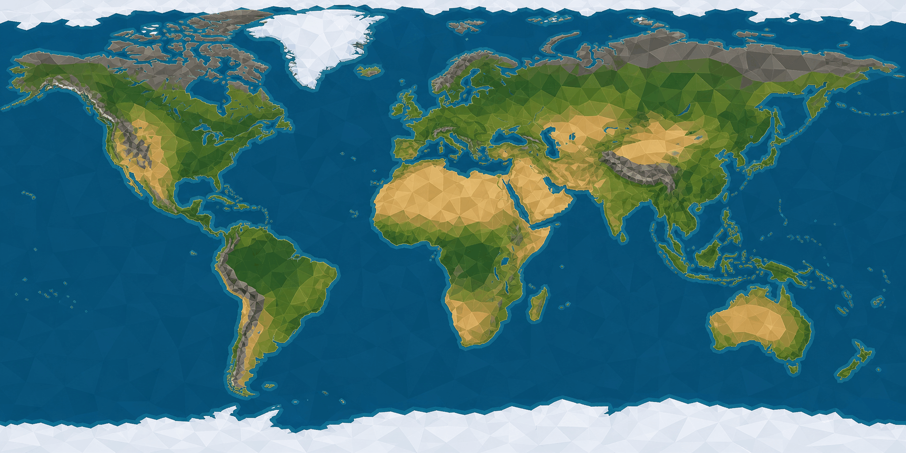

# Texture: overworld Earth map



- **Asset**: `public/assets/textures/overworld/earth-map_albedo.png`, 2048×1024 sRGB, manifest id `overworld.earth-map` in `src/graphics/data/texture-manifest.ts`. The one documented exception to the 1024² texture cap (style guide §6).
- **Generator**: Codex CLI 0.152.1 built-in `image_gen` via `tools/art/gen-image.sh`; native output 1774×887, upscaled with Lanczos to exactly 2:1 and quantised to 256 colours without dithering (faceted flat fills lose nothing) to fit the 1.5 MB cap.
- **Date**: 2026-09-02
- **Prompt file**: [`prompts/earth-map.txt`](prompts/earth-map.txt)
- **Projection**: approximately plate carrée. Map UV from a city's coordinates as `u = (lon + 180) / 360`, `v = (90 − lat) / 180` (v = 0 at the top edge, three.js `flipY` default gives the same result when the plane's UV origin is bottom-left; check one known city and nudge). Continent placement is the generator's, so expect a few degrees of error; city markers should come from the layout data, not from pixel-hunting this image.

## Prompt

```
Stylised world map texture for a strategy game, plate carrée equirectangular projection covering the entire Earth edge to edge: longitude 180 degrees west at the left edge to 180 degrees east at the right edge, north pole at the top edge, south pole at the bottom edge, so Antarctica is a white band along the bottom and the Americas are on the left half. Accurate continent shapes and positions. Flat low-poly style with hard edges and faceted shading, no text, no labels, no country borders, no grid lines, no icons, no compass, no frame. Colours: deep ocean #1F5C73, shallow coastal water #3F8FA8 as a thin band along coasts, temperate land #5E7A3A, forests #3F6B33, deserts #D9B87A, arid scrub #8A8A4A, tundra #6B6A66, mountains #6E6A66, polar ice and Greenland and Antarctica #E8ECF0. Wide landscape image with an exact 2:1 aspect ratio.
```

## Keep

- Faceted low-poly land and ocean on the palette: deep ocean `env-water-deep`, coastal band `env-water-shallow`, temperate `env-grass`, forest `env-foliage`, desert `env-sand`, tundra and mountains `env-rock`, ice `env-snow`. Polar bands top and bottom so a plane reads as the whole globe. No text or borders.
- Second of two variants; the first stretched the continents vertically and drew Antarctica as a blob.

## Change next pass

- Left and right edges are not guaranteed to tile; fine for a plane, would need an edit pass for a sphere.
- If the layout data disagrees with a coastline by more than the marker size, regenerate with the explicit coordinate anchors (e.g. "the equator at exactly half height") or hand-warp in an editor.
