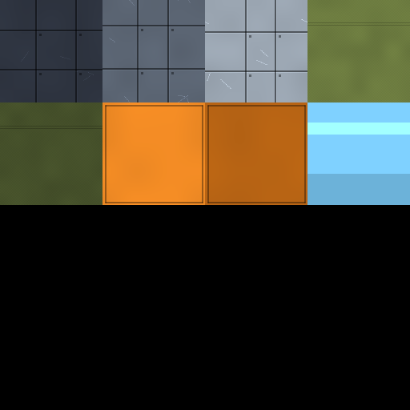
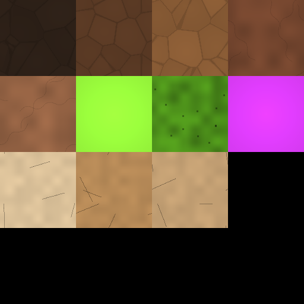
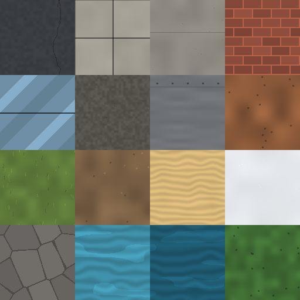

# Textures: palette atlases (units and environment)

| | | |
|---|---|---|
|  |  |  |

- **Assets**: `public/assets/textures/units/tdf-atlas_albedo.png` (`units.tdf-atlas`), `bug-atlas_albedo.png` (`units.bug-atlas`) and `public/assets/textures/tiles/env-atlas_albedo.png` (`tiles.env-atlas`, #394), 512² sRGB, in `src/graphics/data/texture-manifest.ts`.
- **Source**: procedural, `tools/art/build-textures.mjs` (`pnpm art:textures`). No prompt; every cell is drawn from a PRNG seeded by its token name, so the output is byte-stable.
- **Date**: 2026-09-02

## Layout

4×4 grid of 128 px cells, one per palette token (style guide §4). `ATLAS_CELLS` in the build script is the single source of the token → cell table; `build-placeholders.mjs` imports it to remap each textured mesh's UVs into its cell with a 3 % inset against filtering bleed. Every GLB whose tokens have a cell (units, tiles, buildings, props, Blender models alike) references its atlas by relative URI (`../../textures/units/<atlas>_albedo.png`), so the atlas is loaded once and shared.

| Style | Tokens | Detail |
|---|---|---|
| armour | `tdf-grey-*` | panel seams with bevel highlight, rivets at seam corners, wear scratches |
| cloth | `tdf-olive`, `tdf-olive-dark` | weave dither, blotchy tone, stitch line |
| decal | `tdf-orange`, `tdf-orange-dim` | flat with inset border |
| glass | `tdf-visor` | horizontal highlight band |
| chitin | `bug-chitin-*` | wrapping Voronoi plates with cracks and per-plate tone |
| flesh | `bug-flesh`, `bug-flesh-light` | blotchy tone with wobbling veins |
| glow | `bug-bio-green`, `bug-bio-magenta` | near-flat with a soft radial lift (emissive does the work) |
| residue | `bug-bio-green-dim` | mottled pools with dark spots |
| bone | `bug-bone` | pale grain with fine cracks |
| asphalt | `env-asphalt` | fine grain, one wandering crack, pebbles |
| paving | `env-sidewalk` | 2×2 slabs, dark seams, per-slab tone |
| slab | `env-concrete` | soft mottle, hairline seam, pits |
| brick | `env-brick` | 16 px courses, half-offset bricks, light mortar |
| pane | `env-glass` | diagonal highlight band, one mullion |
| gravel | `env-roof` | dense mottle with specks |
| brushed | `env-metal` | horizontal streaks, rivet row |
| rust | `env-rust` | blotchy stains, dark pits |
| grass | `env-grass` | mottle with blade strokes |
| dirt | `env-dirt` | patchy tone, pebbles |
| sand | `env-sand` | wind ripples |
| snow | `env-snow` | soft mottle, sparkle |
| rock | `env-rock` | Voronoi cracks, per-plate tone |
| water | `env-water-shallow`, `env-water-deep` | ripple bands, caustic streaks |
| foliage | `env-foliage` | leafy mottle, dark gaps |

## Keep

- First pass. Enough surface variation that units and tiles stop reading as flat plastic at 64 px per tile while every cell stays on its palette hex on average. `env-bark` and `env-scrub` have no cell (16 cells per atlas) and stay flat.

## Change next pass

- Add a normal or roughness map when real models arrive; the base colour atlas is all the placeholders need.
- Cloth cells could carry a subtle camouflage blotch in `tdf-olive-dark`.
