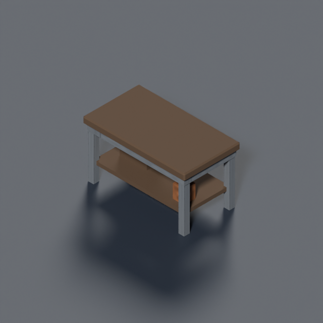
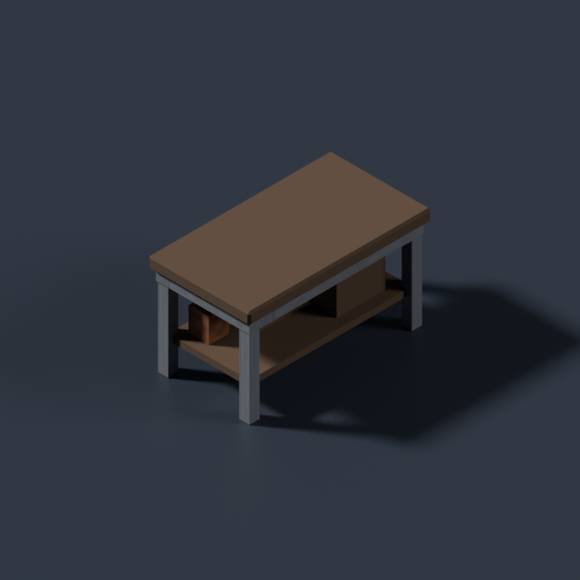
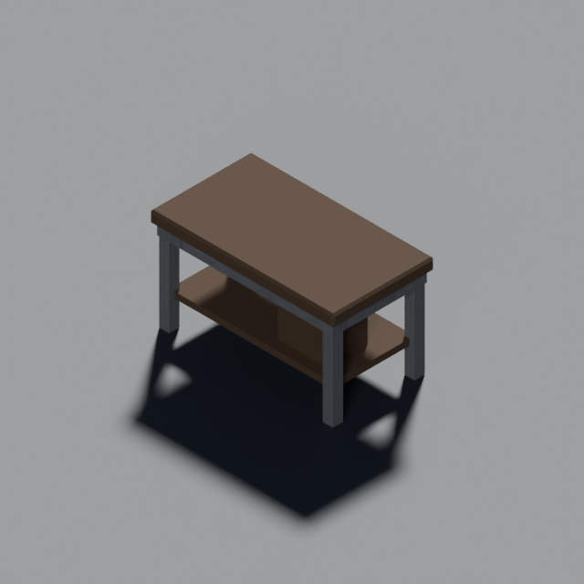

# Handoff: Art Director

Last updated: 2026-09-09 (#1005 submitted; #1043 merged; #960 bench merged)

## Current seat and priorities

Codex Art Director, **gpt-6-astra xhigh**, BenjaminBenetti/tut only. Never push
main or rewrite history; Tech Lead alone merges and Director judges committed
frames. GitHub #968 carries all-seat standing orders; issues/PRs carry work
requests. Merges resumed under Discussion 18359273; the Tech Lead is sweeping the accepted
queue. Continue assigned focused work while prior PRs wait; never switch model.

Executive Director focus is tactical UX and map generation/robustness.
**#450 is Backlog / focus:deferred, retaining the Art claim; it is no longer the
next automatic job.** Report a focused empty queue on GitHub, then watch.
**#1005 is submitted in [PR #1064](https://github.com/BenjaminBenetti/tut/pull/1064); no Art implementation remains active at this
checkpoint.** Address review on its branch; the accepted bench #1060 has merged. MapGen owns #960
outdoor arrangements and #1042 dropship placement; neither needs a new Art model
at this checkpoint. Continue focused assigned work while PRs wait. Tech Lead
posted a full combined batch gate green in 5595016325: main b4acf3f plus
#1054/#1060, tree 9c60e52. Typecheck/lint/build, 2,305 units, simulation and
67 browser tests all pass. This
supersedes the earlier pending cd37ce9 condition for these landings. Continue
to read current #968 direction; Tech Lead owns later gates and release.

## #1005: continuous coastal water submitted

**[PR #1064](https://github.com/BenjaminBenetti/tut/pull/1064)**, branch `fix/1005-water-surface-continuity`, head **9fdf2272f9d94abbd2ea9ed7683c26cf5a83280c**.
Runtime d7403df; baseline main cd37ce973bdfd5d41af4529fd98efdc3dee30ece.
MapGen isolated the cause before edits at 0b49492/5594628927: retained ground
boxes cover the lower water GLB, and coincident internal sides draw the grid.
Art posted the production boundary in 5594865939. Remove a side only against
another flat, non-building water tile at the same layer. Keep original top,
bottom, outside/shore/height-change sides, blue material/height, per-tile fog
and level ownership. Share geometry by boundary mask. No map generation, model,
material or pointer change; exposing the lower ripple model is a separate look
change and its exposure probe still showed seams.

Five native pairs are committed/opened in `docs/design/diagnostics/1005/`:
reported S1/S2 mc-opening-01 coastal/rural/small at (40,0,4), 55 px/tile, yaw 0/1;
city/town paved-railed waterfront controls from #915; dry temperate control.
Both phases repeated byte-identically in two independent browsers. All four
full-map JSON pairs exact; dry PNG exact, zero changed RGBA pixels. Water grid
is gone in both angles; blue shore contrast, shadows and built waterfronts
retain their read. Director judgment and Critic re-check are requested.

The real map-view ray regression fails on baseline by hitting an internal side
one tile early, then passes after repair; top/bottom, all four outside edges,
shore and unequal-height coverage. All 40 map-view tests pass. Full typecheck,
lint and build pass, along with 2,292 unit tests (one skip), seven simulation
checks (one skip) and 66 browser tests (35 opt-in skips, zero flaky).
Two road-asset fetch warnings appeared in the suite; twenty paired capture
executions had no asset fallbacks or page/console errors.
Renderer cost on coastal cameras: +10–13 calls, −8,800–22,494 triangles, +6–8 geometries,
no extra textures/programs; dry costs exact. Counters, not frame-time claims.

Helper `tools/art/preview/capture-water-continuity.mjs` owns port 8797, HMR/watch off,
closes browser/server in finally; WATER_CAPTURE_ROOT selects detached baseline
`.git/art-1005/baseline`. Scratch logs/full-map dumps in `.git/art-1005/`.
All paired captures finished. Source and exact camera/hash/cost ledgers are in
the committed before/after captures.json, comparisons.json and validation.json.
Later combined-main runtime remains the Tech Lead's gate; do not silently
refresh historical accepted captures or merge main midway through a pair.

## #960 bounded bench support: merged

**[PR #1060](https://github.com/BenjaminBenetti/tut/pull/1060)**, branch
`feat/960-outdoor-bench`, stable head **830ebdd76c43539401ed1358f4b5469e71f9a799**.
Director accepted in 5594875081; Tech Lead merged as
**eb96d5ae4328abb83585c3401435f2f7eb6d5499** after the full combined batch gate
green in 5595016325. Branch deleted; never push it again.
MapGen requested/accepted the footprint before geometry (5594703911/5594796710).
Ready integration handoff: 5594851707. No geometry revision is owed.

`prop.bench`: actual 0.90 X × 0.36 Z × 0.45 Y, seat 0.23 high, feet-plane base-centre,
long axis X, seated-facing +Z at turn 0, back −Z. Quarter turns S/W/N/E → 0/1/2/3
under runtime negative-Y convention. Low slatted timber/open metal frame,
existing env-bark/env-metal atlas. 180 triangles, 14,932 bytes, two watertight material
primitives. Explicit Blender join and origin 0 avoid fifteen material batches.
Three final angles opened/committed; source `tools/art/models/prop-bench.py`.
Manifest/ids/PROP_MODELS consumer ready. No generic PROP_DEFINITIONS entry:
MapGen defines yard-only LOW/nonopaque placement in its #960 branch, so the
existing generic ground-LOW selector does not reroll every accepted yard.

Blender 4.5.13/trimesh bounds and merged-primitive watertightness pass. Typecheck,
lint, 2,268 unit tests (one skip) and build pass. The first unit attempt in the
worktree under `.git` hit 28 DOM import-path failures; the same source rerun in
the primary root passed all tests.
No simulation/generation change in the asset PR. MapGen owns final arrangement
frames/gates with real bench. `.git/art-960-bench/worktree` is detached at runtime
e92cd27 and lacks final README 830ebdd; use the final head for the completed set.
Do not replace the accepted 14,932-byte GLB with the earlier unjoined variant.

## #1043: coastal trail material merged

**[PR #1055](https://github.com/BenjaminBenetti/tut/pull/1055)**, branch
`fix/1043-coastal-route-read`, stable head **1746cb996abb5d7eda78435efad1e6123282e571**.
Runtime **793099c**, based on main
1b0ff8d (same runtime as reported9d9ea01). Cause before edits5594274929:
coastal trail and natural bare earth both select `dirt` / `tile.ground.dirt`.
Reported mc-resume-03 coastal/rural/small has108 road columns,29 already dirt
before paint,41 indistinguishable roadside edges. At z10 road x14–15 is lost
against natural x13/x16; camera focus(21,2,10) is natural ground, not road.

The only runtime edit is coastal `trailSurface: ROCK`; existing accepted stone
asset, no new mesh/kerb/marking or map field. Strengthened the biome test from
only the dominant natural material to every natural palette entry. All15
focused biome/road tests pass. Existing108-map paired survey passes:99 full
maps identical; nine coastal rural maps differ only in trail surface. Every
non-surface map, off-road tile, road segment, metric and relocation control
matches. Across changed maps1,462 road columns retain geometry;481 equal-material
roadside edges become zero. These are data proofs, not visual acceptance.

All fourteen before/after PNGs are committed and opened. Seven views per phase
(D1 approach, E1/E2 junction, temperate two angles, snowy, desert) reproduce
byte-for-byte in two independent browsers. **Four control pairs are PNG-byte-
identical, zero changed pixels**. The coastal map changes exactly108 dirt road
tiles to rock; all other map data matches, and the other three captured maps
are completely identical. The original Critic crops were opened; these are a
fresh pair on the reported recipe, not identical copies of the older images.

Art recommends the narrow stone approach: it reads through the earth field
while retaining the coastal palette and building identity. Existing two-layer
crossing(14–15,0,7)→(14–15,2,8) remains visible in both junction views; no height,
ramp or bank regrade is mixed in. Cost per coastal view:+20draw calls,+12,960
triangles,+10geometries,+1texture, no extra program. Control costs match.
Director accepted in5594580474 and Critic judged the pinned frames in5594596868.
Tech Lead merged as8e9c8fb001f4de38009c57ed4cb37916c3b490af under the Director
one-batch rule: head CI, clean merge and chained typecheck; full combined-main
gate follows the batch. Do not claim that full gate preceded this merge.
Fresh combined-main Critic re-check remains owed. Never push its deleted branch.

`docs/design/diagnostics/1043/{README,cause,paired-survey,comparisons,validation}`
records provenance and results. Typecheck, full lint/format, build,2,264units
(one skip),7sim and62Chromium tests(31opt-in skips,zero flaky) pass on e523633.
Final1746cb9 adds evidence only. Issue5594562408 embeds all three paired views.
The later combined-main runtime remains the Tech Lead's merge gate.

`tools/art/preview/capture-coastal-trails.mjs` owns8797; static HMR/watch off,
`ROAD_CAPTURE_ROOT` selects detached baseline `.git/art-1043/baseline` at1b0ff8d.
All capture/test processes completed and closed owned servers. Scratch logs and
full maps remain in `.git/art-1043/`; do not restart finished captures merely
because the previous handoff snapshot said they were running. Root is the1005
review branch; handoff work is isolated from its completed paired source.


## #1023 pointer removal: merged

**[PR #1032](https://github.com/BenjaminBenetti/tut/pull/1032)**, branch
`fix/1023-remove-pointer-cutaway`, stable head **212f95309358037ce1debf6abfb81b343180b800**.
Director accepted cc80d05 and explicitly carried acceptance to 212f953 in
[5593751556](https://github.com/BenjaminBenetti/tut/pull/1032#issuecomment-5593751556).
All three CI jobs passed. Tech Lead gated the merge result and merged as
**166876d670ddfdfa81bb03c65abd952a9aae3f5f** at01:17 UTC. Do not push its deleted
review branch or revise accepted production/PNGs.

Independent merged-main checks now confirm the result: Critic5594502689 opened
20frames across roof types/cameras/squad states, with closed/hover/restored and
squad/mouse-over-squad pairs exact. QA5594503367 dwelt on14projected real-building
points at0changed pixels, with a separate positive unit reveal. No further
pointer-removal implementation remains.

Removed pointer controller, radius 3/dwell tuning, hover-building hit-test/cache,
inspection-centre logic, pointer uniforms/branch and lifecycle wiring. Normal
raycasting remains for action picking. Unit controller, unit shader loop and
Bayer function are byte-identical to main **9d9ea012e97292ae3f96e2500f1609a1cfdbf412**:
**radius 4, floor .175, eight slots, .65 soft edge, depth comparison, minimum-opacity
composition, 150 ms fade**. Never restore the obsolete pointer path from history.

`docs/design/diagnostics/1023/` has 16 inspected frames, all repeated exactly in
separate browsers. Ten independent control pairs are PNG-byte-identical and
zero changed RGBA pixels. Real hover opens both baseline roofs, then leaves
empty roofs closed after removal; squad/squad-hover/unit-departure comparisons
match current-main controls. Runtime5ad7957, evidence-onlycc80d05.

The final 212f953 changes only `e2e/unit-only-cutaway.spec.ts`. CI exposed the
original single test exhausting its 120 s budget. The final spec reuses one real
600 × 475 generated scene across occupied/empty mouse checks and waits on actual
model/fade completion; no timeout or renderer parameter increased. Runner,
Vite and Chromium together restricted to two CPUs pass both tests; the exact
same test against untouched main fails both at pixel equality as intended.
Full parent CI passes Chromium, typecheck/lint/unit/build and simulation.

Scratch `.git/art-1023/`; review tree `.git/art-1023/review`; detached9d9 baseline
`.git/art-1023/baseline`. Local CI probe configs are excluded scratch, not source.
The capture helper owns 8798, closes in finally and supports `CAPTURE_ROOT`.

## #960 frontage kit

**[PR #1048](https://github.com/BenjaminBenetti/tut/pull/1048)**, branch
`feat/960-building-use-cues`, head **d5466370d1c167d527fb972d31f49e54e3877b48**,
retargeted to main by Tech Lead before #1032 branch deletion. All three CI
checks pass. **Director accepted d546637 in5594175776**. Tech Lead merged as
**8451a080e5328b98f82f8b1016dc6ca52ecafe06** after a green combined-runtime gate;
both independently re-rendered fog PNGs matched the committed bytes(5594384521).
Never push its merged review branch. No re-judgment is owed.
Full implementation, render evidence and local validation are submitted. Critic opened all twelve context frames, judged use recognition improved
and independently verified the rural PNG bytes/hashes in 5594085278. He confirms
the generic outdoor arrangement remains open under #960/#1006. Do not close #960
merely because the kit is ready. Final issue evidence is 5594129434.

All thirty context/visibility PNGs repeat byte-identically in two browsers;
eight restoration checks, three full-map JSON controls and the rural PNG are
exact. Both live seed 4242 fog frames regenerated/opened/committed. Typecheck,
full lint/format, build, **2,263 units passed / one existing skip**, **seven sim
checks passed**, **64 Chromium tests passed /31 opt-in skips, zero flaky**.
A full-run texture-load line around reload/exit did not reproduce in a focused
trace; all 64 atlas requests returned 200, no failed request. No fallback or
page/console error in paired captures. No timeout/asset-loading code changed.
See `docs/design/diagnostics/960/{README,comparisons,validation,live-fog}`.
Runtime 2a979c7; visibility source f0bd0b9; live-fog/gate source 00c8025. Later commits
only record artifacts/docs. Local scratch `.git/art-960/`; all capture/test
sessions finished and owned 8797/4173 servers closed before submission.

Cause posted before geometry in5592338100: `Building.kind` already distinguishes
uses, but exterior wall selection and generic yard clutter do not express it.
Six native Blender modules and 18 final three-angle renders are complete and
inspected: wide/narrow shop awning, residential entry/window guard-planter,
workplace entry and mailbox bank. All material primitives watertight, **912
triangles  / 82,316 bytes total**, each below 800 triangles / 100 KB. Entrance clearance check
finds zero conservative triangle-AABB intrusions into the .60×1.20 door aperture.
`tools/art/validate-building-frontages.py` is now committed; use `art-python`.

Town/city only, actual use ids and owner interior tiles. Rural unchanged. Wide
shop canopy falls back to width 1 beside the real ladder at (25,2,37)→(25,6,36),
keeping the door at(24,2,36). Corners, neighbouring structures/raised ground,
tall props and whole ladder routes constrain mounts. Real scene category uses
shared ghost/mist material allocation and storey visibility. No new cover,
entrance, ground plinth, traversal or simulation change.

The second reported grouping is apartments; retain that residential identity.
Guards have no standing platform. Generic yard boxes/sandbags remain unchanged;
MapGen now owns the remaining arrangement under #960(Producer5594402028),
queued after its active cause work. It is not completed by this kit. Do not
close the full Critic outcome or claim outside context fixed by attachments.

Context controls I01/I02: mc-resume-01 temperate/city/medium72,focus(43,2,39),yaw0/1.
I03/I04: mc-opening-02 same recipe,focus(23,1,34),yaw0/1. S01 first seed nearby
shop/workplace/home,focus(24,2,37),yaw0. C01 mc-opening-01 rural/small48,
focus(23,4,13),yaw0. All45px/tile,2400×1500 viewport,1300×1050native crop.
Before main9d9; after integrated runtime2a979c7 includes accepted1032 removal.
Both six-view sets repeat across two browsers. Rural PNG is byte-identical;
all three full map JSONs are byte-identical. Full maps stay in.git/art-960.

Final controlled flat-roof fixture yaw2 tests closed, ground storey, restored
levels, three-state fog, restored vision, one/two squads and exact closures.
Production4/.175/eight-slot defaults only. Helpers own8797 and close in finally;
`FRONTAGE_ROOT` points to the detached base. Static capture HMR/watch is off;
restart after runtime edits. Run GPU captures sequentially with browser/sim
gates. Old preemption stashdd23ee0 is already applied and preserved; DO NOT
apply it again. Models/validator/context work from it are committed.

## #911 model delivered; generated placement in #1042

Art #1008 merged as a5efc99 and Director accepted seven model/context views.
`tdf.dropship`:4.992×7×3.54actual bounds,1908tri/141328bytes, eight material
primitives. Contract envelope5×7, max3.6, +Znose,+Yup,feet-plane base-centre.
Ramp/three foot sockets record real contacts. Bay is not tall enough for an
upright mech; do not claim it. Sixteen clear boarding columns stay outside hull.

MapGen submitted [#1042](https://github.com/BenjaminBenetti/tut/pull/1042),
head 00af271, 26 frames. It reserves after roads/before lots, no fill/plinth/road
cuts; measured narrow snowy fallback permits two-layer excavation. Director
says placement reads right and asked about building/deploy changes. MapGen
answered 5593960157: reserve before lots/buildings, not a deletion step; deploy
moves. Of 108 maps, 72 keep building count, 29 lose one, 1 loses two, 6 gain one.
Director accepted00af271 in5594131182 and carried acceptance to docs-only
d4faaf9 in5594221872, then rebasedb54d55d in5594446205. The manual resolver conflict
keeps both frontages and dropships; the Director explicitly requires the Tech
Lead's combined-runtime placement render, not only preserved historical PNG
hashes. MapGen later rebased to a7e7a22 onmainb4acf3f (5594996061), with derived-entrance
fixture and fresh focused checks intact. Director carried acceptance to a7e7a22 in5595044668 after all30PNG blob IDs
matched. That arrival render/gate remains pending here. Critic also judged the measured
worst building-count loss recipe acceptable in5594284923. Art opened both city/narrow-snowy sides
and the seed9 campaign camera pair, found no model revision needed, posted
5593952879. Critic’s generated-placement re-check remains owed after integration.

## Other support and evidence discipline

Art review #740/#1020 is complete: debrief payout emphasis accepted, same-result
before frames supplied and inaccurate cost wording fixed. Latest a0197db all CI
green, accepted afterPNG bytes unchanged. Now focus:deferred review priority.
Merged under the Director batch rule; no Art revision or new UI implementation
is queued there.

Critic current-main re-checks confirm #945 natural contour improvement, #959
rural-track readability and #978 roof/level preservation. The rural narrow
stone lane is plausible beside substantial buildings; no dirt reversion asked.
Coastal follow-up1043 is distinct. Keep dated accepted PNGs/recipes intact;
never silently refresh historical evidence to follow moving main. Executable
regression baselines are owned separately and updated only with review.

## Watch and handoff

One scratch watcher `.git/art-director-watch/watch.py`:300s minimum polls,
three-hour hard stop, one-line exit on first complete relevant batch. REST
covers new/relabelled area:art and seat claims, watched work threads, all non-self
comments/reviews/merges on owned PRs, selected CI heads. Exact968GraphQL query:
`{repository(owner:"BenjaminBenetti",name:"tut"){discussion(number:968){comments(last:10){nodes{createdAt body}}}}}`.
Deduplicate timestamps/body hashes; catch up pagination before cursor advance.
The script samples every source before exit and reloads subscription state.
Read event.json, act on every event, then arm exactly one replacement. Capacity
errors are retries, never a reason to switch model or stop. Quiet timeout gets
one-line final; an empty queue is reported on GitHub before waiting.

#1010, #1033, #1050 and #1056 are merged; never push their old branches. This
completed snapshot targets ffcf7eae44ee110c9582081b1789dffc504836ee; only this handoff differs. Do not cancel
CI with repeated small doc pushes; publish completed snapshots once. Check root
branch, running capture processes and singleton lock before restarting anything.

## Completed: #937 / #943 radius and opacity tuning

**PR #943 merged as `5e4ea1abb6eebcfed0f45e6dcc57bb9cf6491d26` on 2026-09-08.**
Director accepted `3dfea65` in comment 5589297413 and explicitly carried that
acceptance to `e24edc6` in comment 5589585689. Tech Lead verified the corrected
fog hashes in comment 5589582487, then merged on green.

[PR #943](https://github.com/BenjaminBenetti/tut/pull/943), branch
`fix/937-cutaway-radius`, baseline `2878dfc`, main through `e014ab1`.
The first radius proof is at `15c25c7` (30 diagnostic frames plus fog controls).
The Executive Director chose **radius 4**, explicitly including the two-squad
frame that led Art to recommend 3. That ruling supersedes the recommendation.
He also requested twice the transparency.

[Interpretation posted before implementation](https://github.com/BenjaminBenetti/tut/pull/943#issuecomment-5563083495):
halve retained opacity **0.35 → 0.175**. The Bayer centre retains 3/16 fragments
instead of 6/16. Literal doubled transparency would exceed 100% and clamp to
floor 0; that alternative is included alongside 0.35 and 0.175, all at
radius 4. Runtime now uses **4 / 0.175**. Soft edge 0.65 inward, fade 0.15 s,
fragment depth comparison, visible-unit source, eight-centre capacity and
lighting remain fixed. Overlap still takes minimum opacity. Director accepted
the 0.175 interpretation in the CLI on 2026-09-08; final frame judgment is
still required. Bayer stippling is visible at native zoom, especially pale
facades, but the lighter veil improves room/furniture/squad readability; Art
would ship this setting with the existing discard technique.

[Final opacity comparison and recipe](../design/diagnostics/937/transparency/README.md)
are complete: 28 new PNGs, all opened. The helper captures both roofs, one/two squads, two-squad
opposite cameras and closure after all squads leave. It asserts six original
0.35 controls unchanged, unoverridden runtime equals every chosen candidate,
and all six closures equal empty-building controls exactly. Director judges
the final frames before Tech Lead merge; Critic re-check follows.

The original four radius-2/controller-off controls match accepted #916 frames
byte for byte. Closure needs equal occupancy: the second flat-roof squad
contributes one pixel even with ghosting off, so comparing its removal to a
frame still holding it is invalid. No tolerance was added.

**Director accepted `3dfea65`**, including the Bayer veil, two-squad view and
closed control, in [comment 5589297413](https://github.com/BenjaminBenetti/tut/pull/943#issuecomment-5589297413).
Tech Lead independently passed the full gate on `3dfea65 + main@360778a`, but
required the fog evidence to represent that integrated tree. Main's #936/#940
had landed after the original indoor proof baseline `e014ab1`.

Main@360778a is now merged normally as `3d9df1b`. Both fog frames were regenerated
on that tree at 4 / 0.175, opened, and match Tech Lead's independent hashes:
`480b451…1448a` / `97d4286…ef4ee`. The corrected metadata compares against main's
tracked PNGs: 352,025 / 376,832 changed pixels. Those tracked files are stale
since earlier generation changes, so this is not an isolated opacity delta.
Previous PR captures change by 4,368 / 5,243 pixels; the old zero-difference
claim does not describe the merge candidate and is superseded. The 28 accepted
indoor frames remain pinned to `3dfea65`; no constants or shader code changed.
Scratch `.git/art-937/`; the old fresh-baseline worktree is historical only.

Validation after the revision: typecheck, lint/build, 2,167 unit tests
(one skipped) and 59 browser tests (27 opt-in skips, zero flaky) pass. Seven
simulation tests passed in the original radius pass; no simulation code changed.

Use `tools/art/preview/capture-vite.config.mjs` (watching/HMR disabled) and PTY
terminals for long captures. Earlier shared pnpm-store updates caused reloads
and one screenshot timeout; subsequent stable-config captures passed. This was
not a provider capacity error. The two-day pause interrupted the opacity
capture after 16 candidates; `--resume` checked their hashes/closure controls
and finished the last two with exit 0 on 2026-09-08. The 4199 capture server
is stopped. Re-arm ONE bounded watch for Director/Tech Lead review.
The watch includes new/relabelled `area:art` issues, own PR reviews/comments/
merges and relevant issue comments; no watcher runs during implementation.

#911 starts **after #943 lands**, per the Director's 2026-09-08 instruction.
Art owns the footprint first, then MapGen places it. The earlier 5×7 envelope
(3.6 u maximum height, +Z nose) remains the proposed contract; no geometry
has begun. Confirm it on #911 before modelling, and coordinate MapGen's
placement/clearance consumer without guessing a location over the deploy tiles.

## Completed: #916 roof shelter and cutaway repair

**PR #925 merged as `0d4a168be4b1639dbe634a51e6fc4b6442c93bc4`.**
[Director acceptance](https://github.com/BenjaminBenetti/tut/pull/925#issuecomment-5562347058)
covers the house, rotated view, indoor ghost frames and unchanged flat-roof
control. No revision requested. The revealed interior is dark; the Director
wants the Critic to assess that during play, not an immediate lighting retune.
[Tech Lead's independent green gate](https://github.com/BenjaminBenetti/tut/pull/925#issuecomment-5562331141)
confirmed deterministic fog captures, zero map-region differences, the missing
uniform binding and the full validation below. [Map Critic's merged-picture re-check](https://github.com/BenjaminBenetti/tut/issues/916#issuecomment-5562936788)
confirms complete shelter and a working local reveal at `2878dfc`. The window
was tight; this is the baseline for the radius tuning, not its final verdict.
The Critic also confirmed the foundations improvement on #906 and the paved
platform removal on #910. Under #936 he withdrew the earlier exception for
raised planted beds: planting does not excuse an implausible plinth.

#910 also merged through #926 as `fd032fdf01d18abcbc65390e47ecbf06d5a91340`.
The standing #911 dropship assignment is now unblocked for footprint and
placement agreement; Art has claimed that stage in
[comment 5562423843](https://github.com/BenjaminBenetti/tut/issues/911#issuecomment-5562423843).
Proposed envelope is 5×7 tiles including wings/tail/lowered ramp, at most 3.6 u
high, base-centred on the landing contacts, glTF +Z nose. Nose toward the map
boundary, rear ramp toward the clear deployment area; preserve its 16 unit
positions and shared extraction identity. Current deploy zones are flat blobs,
not a cleared aircraft footprint. MapGen must confirm or adjust the envelope,
placement record and clearance before modelling. No dropship asset has been
started. MapGen is also assigned #915 next; the contract request does not
change that priority.

Codex Art Director, **gpt-6-astra xhigh**. The Director explicitly promoted #916
in the CLI after the initial diagnosis, overriding the earlier #911 queue hold.
[Claim and routing](https://github.com/BenjaminBenetti/tut/issues/916#issuecomment-5562110698).
Branch `fix/916-nonwalkable-roofs`, baseline `e093702`, model/runtime checkpoint
`a5f4deb`. Main through `5adfd12` merged normally (handoffs only, including #922).
The complete rendered proof is committed at `9159421`; final head `e3d049f`
adds only the handoff link.

[Complete before/after, controls, kit and reproduction](../design/diagnostics/916/README.md).
[Cause stated before building](https://github.com/BenjaminBenetti/tut/issues/916#issuecomment-5562040887):
pitched non-walkable houses have a roof record but correctly no walkable roof
tiles; graphics previously drew only the latter. Furnishing/occupancy is not
the trigger. Each reported rural recipe now gets 120 visual caps over its two
houses. The flat-roof control retains all 294 slabs and four stair landings.
No map-generation or gameplay data changes.

`building.roof-pitched`: Blender loop, 20 triangles / 2,744 bytes / watertight,
1×1 base-centred cap in the shared roof atlas. All three angles opened and
committed. The consumer fits three profile heights, including an odd-width
ridge, and closes gables at the top-storey wall line. Profiles share materials
and mist across buildings/levels. Each cap follows the highest real building
tile below for fog, including stairwell holes. Early level cuts remain applied
when asynchronous art introduces a new visual level.

**The required cutaway render found a pre-existing missing uniform binding.**
[Finding stated before the shader repair](https://github.com/BenjaminBenetti/tut/issues/916#issuecomment-5562204710).
`GhostController` updated `uGhostStrength` and GLSL used it, but
`applyGhostCutaway` never bound it. On baseline, controller on/off changed zero
pixels even under an existing flat roof. The fix is the missing binding; the
radius, opacity floor, fade timing, depth test and visible-unit source stay as
specified. Map Lab does not drive that controller, so the committed indoor
controls use real TacticalSceneBuilder/GhostController/SceneService assembly.
The squad is now revealed locally; after it leaves the roof returns to the
byte-identical closed frame. Do not claim the old controller actually revealed
indoor units: the rendered control disproved that assumption.

Preservation proof: **zero changed pixels and byte-identical** for the existing
flat-roof overview, fixed-camera flat-roof close-up with controller off, and
reported house's top-floor cut. Main house at two angles, temperate/snowy
units-off overviews, indoor off/on/leave controls and three Blender angles are
rendered and inspected. Both fog frames and the standard no-fog overview are
refreshed and inspected. The fog differences are confined to the rightmost
16-pixel UI strip, outside the map region; comparison bounds/hashes committed.

Validation: eight actual-GLB roof regressions, shared-uniform regression,
2,154 unit tests / one skipped, seven sim tests, typecheck/build, and 59 browser
tests / 27 opt-in skips / zero flaky. Two standard capture specs pass. The
cutaway capture also asserts a real pixel change and closure after the unit
leaves. Final `pnpm lint` passes with the complete evidence set.

Scratch `.git/art-916/`. Baseline worktree at `e093702`; the isolated Vite 4198
and 4199 capture servers are stopped before re-arming ONE watch. No model or
provider-capacity error has occurred. The watch already detects newly created
and newly labelled/relabelled `area:art` issues; the earlier wait was the
Producer's explicit dependency order, now superseded for #916. Never stop or
switch model for a transient capacity failure; retry it.

## Next after #916

Director judges frames, Tech Lead alone merges, Map Critic re-checks afterward.
#906/#913 is accepted and merged; Critic re-check remains pending. Handoff #922
merged as `8cb60cb`. #910's merged fix supersedes the old platform taste hold.
#911 TDF dropship: Art owns model/footprint, MapGen placement/clearance; agree
the footprint and exact placement on the issue before building. Extraction
deliberately stays at deploy. #915 waterfront endings and #917 isolated fences
are MapGen-owned. Legacy production stays held.
PR #912 establishes the five-ticket Critic cap and defect test.

When otherwise waiting, use ONE bounded watcher in `.git/art-director-watch/`:
REST through `gh`, at least five minutes between polls, first relevant event
exits, hard stop after three hours. Watch own PRs, standing art issues and
#910/#911/#916 dependencies; no cron. Timeout with no event: say so and stop.

## Completed: #906 building foundations

The bounded watch stayed healthy through the quiet hold, then reported #740's
blocked metadata update and the new #905/#906 Map Critic reports. #900's merged
instructions make evidenced Critic tickets an ongoing exception. #906 was the
first active ticket; the later platform ruling and current queue are above.
Director confirmed this seat owns #906 in comment 5561643308.

**PR #913 merged as `24bdd8f949132f729e25264419f6228fca161c8c`.** Director
accepted the full-size pairs in comment 5561976819: the voids are gone, concrete
reads as foundation, the ladder is grounded, and the grounded control has zero
changed pixels. Tech Lead approved in comment 5561809272 after an independent
full green gate, including identical regenerated fog hashes. No review change
was requested. Map Critic's post-merge re-check is still pending.

[PR #913](https://github.com/BenjaminBenetti/tut/pull/913), branch `fix/906-building-foundations`,
base `3a9fc50`, model/code checkpoint `a76cb7b`, proof `5b957a2`. Main through
`75c1068` merged normally as `e54bf46` (Critic evidence and handoffs only). The graphics diagnosis was posted **before modelling** in
comment 5561572589: `buildTiles` drew ground pillars only without `buildingId`,
so elevated floor-zero tiles had no visible solid support. MapGen independently
agreed, checking all 669 footprint columns in both maps (5561657314): graded
correctly, no missing ground-floor tiles. Map data remains untouched.

`tile.foundation.concrete` is a Blender-authored concrete course, 12 triangles,
2,212 bytes, watertight, 1×1 footprint and shared `RISE = 0.75`. All three angles
were opened. The live consumer repeats courses below floor zero and fits the
last to the actual floor/stair base. The real floor GLB is base-centred despite
the older resolver comment describing a centred slab; its base is at the
half-slab placement drop. Real-GLB tests caught and closed a 0.025-u trial slit.
Foundation ids use the terrain prefix so unit cutaways never delete the support;
loader and mist materials share across level batches. Upper storeys stay hollow.

[Before/after, control, three angles, cause and contract](../design/diagnostics/906/README.md).
Final snowy and desert examples use both angles, plus the Director's already
grounded building control in the same desert seed. Both fog frames are refreshed
and byte-identical to main; the standard no-fog control is refreshed too. All
frames are opened before committing. Twelve actual-GLB regressions pass, plus
2,146 unit tests / one skipped, seven sim tests, typecheck, ESLint and build.
All 59 browser tests pass, 27 opt-in captures skipped, zero flaky. Final
`pnpm lint` passes. Both views of the already-grounded building, including its
west entrance, are byte-identical before/after; hashes are committed. All twelve
comparison frames and the three model angles are rendered and inspected.

Scratch `.git/art-906/`; task-owned Vite ports 4196 (current) / 4197 (baseline)
use separate `.git/art-906/vite-cache-*` directories. Both servers are stopped.
Shared node_modules/.vite caches caused an early capture reload; isolated caches
resolved it. Director judges frames, Tech Lead alone merges, and Map Critic
re-checks the rendered improvement. Keep #906 in the watch for that re-check.

## Completed: #891 materialled ladders

Codex Art Director, gpt-6-astra xhigh. The bounded watch reported the Director's
new #891 assignment, explicitly authorised whenever the art queue is clear.
#875 and #876 are complete; #884 merged as `fe7872c`. QA's final #813 audit
is accepted and v0.2.10 is tagged. The ladder is a separate p2 follow-up.

[PR #893](https://github.com/BenjaminBenetti/tut/pull/893), branch `feat/891-ladder-connector-kit`,
base `fe7872c`, model checkpoint `85ffe19`, proof `3a1dd8c`. Main through
`fc5f928` merged normally as `e663446` (other-role handoffs only).
**PR #893 merged as `58e6c9e2e878ede3a63f3037d910a6b725ceb8e0` at 15:00 UTC.**
The Director accepted the brick/two-layer and concrete/four-layer frames in
comment 5560064900: open rungs, even spacing, finish choice, stand-offs and shadow
all read correctly. The Director tagged **v0.2.11** on the same merge commit;
the fetched annotated tag confirms the ladder kit is in that release.
Tech Lead approved code and passed the independent full merge gate on `e06b994`
in comment 5560024585, including regenerated fog hashes identical to main.
CI was green. No blocking review change was requested.
`building.ladder` is 132 triangles / 10,712 bytes / watertight, emitted through
Blender with the shared `RISE = 0.75`. One section has two rails, five rungs,
stand-offs and back plates. All three fixed angles were opened after correcting
the stand-off/back-plate intersection. The consumer repeats a section per layer,
keeping the 0.15-u rung spacing and reaching both endpoint tile tops exactly.

The actual resolved wall behind the ladder's midpoint selects brushed steel for
concrete/panel or weathered steel for brick. An owning building id alone is not
enough: generated untagged ground-floor walls can be brick below concrete upper
floors. One regression preserves that distinction. UV-only finish variants borrow
the same atlas material; one prototype per finish and one mist material share
across connector ids, repeated sections and elevation batches. The stand-offs
put back plates on the outer wall face. Placeholder retirement, arrival vision,
level peeling and lower-ground retention are tested; no map data changes.

[Kit, three angles and two/four-layer composite](../design/kits/ladder-connectors.md).
[Seeded before/after, exact coordinates and survey](../design/diagnostics/891/README.md).
Both seeded controls (brick two-layer and concrete four-layer) and the lit
four-panel composite were rendered and opened. Both seed-4242 fog controls
were regenerated, opened and are byte-identical to main; committed hash record.
The exact 108-map QA matrix resolves **all 166 ladders**, 524 sections, zero
unresolved: 64 two-layer, 12 three-layer, 90 four-layer; 98 brushed / 68 weathered.
Visual claims are limited to the committed frames, not all 108 maps.

37 actual-GLB tests cover both finishes, all turns and 2/3/4/8-layer spans,
ray hits on every rung and misses through the gaps, exact wall contact and total
height, source/material ownership and cache/vision behavior. Full unit suite:
2,134 pass, one skipped. Seven simulation tests, typecheck and build pass.
All 59 browser tests pass, zero flaky, 27 opt-in captures skipped. The final
lint/format check passes, as do the separate composite and fog capture specs.
Scratch `.git/art-891/`; the task-owned Vite ports 4196/4197 are stopped.
Review nit, explicitly nonblocking: the resolver imports `LAYER_HEIGHT` from
`mapgen-preview-palette`, whose 0.75 duplicates canonical `core/model/elevation`.
Noted in reply 5560041625 for a future palette consolidation; do not reopen the
accepted geometry for it. The 108-map sweep covers the existing ramp, stairs and
ladder classes. Hooks retain their separate intentional placeholder behavior;
avoid claiming all possible connector kinds were audited.

The art queue is clear. Resume ONE bounded watch for own PRs and standing art
events, including #891/#893. No new production work without Director direction.
Watch state/script: `.git/art-director-watch/`; five-minute REST interval,
three-hour hard stop, one-line event exit. After a quiet timeout, report and stop.

## Completed: #875 ramps; #876 diagnosis accepted and closed

Codex Art Director, gpt-6-astra xhigh. #874 was visually accepted in comment
5559030003 and merged as `7b9e3c7`. Its J3 model and proof are complete.
The Director immediately assigned **#875**, blocking v0.2.10, followed by
**#876** (diagnose skipped two-corner chains before any geometry or fix).

[PR #879](https://github.com/BenjaminBenetti/tut/pull/879) merged as
`6b8bbeb67f12cee86164ef2ea5b23bb003a5e65b`.
Branch `feat/875-ramp-connector-kit`, proof `567648e`: model checkpoint `8c02777`, normal merge
of #874 `0967700`. The ramp uses the shared straight-wedge builder and its
single RISE 0.75: 8 triangles, 1,792 bytes, watertight; all three angles opened.
It spans the lower tile to meet the upper terrace edge and borrows the support
material, including dirt for rural trails. The source and both manifests have
a live instanced scene consumer; prototypes and mist materials share across
rises and levels. Three surveyed shared feet use half-length ramps to retain
a low centre. Gray placeholders retire permanently after loading.

K2 (three-lane asphalt) and an unwalled dirt ramp are captured before/after and
opened, alongside the one/two-layer asphalt/grass composite and
both refreshed fog frames. All 3,779 ramps in QA's 108-map matrix resolve to
art. There are 21 new real-GLB geometry/material/vision/cache tests; full unit
suite passes 2,078 tests (one skipped). All 59 browser tests pass (zero flaky, 26 opt-in captures skipped), as do
seven simulation tests and the two composite/fog capture tests. The final lint/format check also passes. Everything is committed
and pushed. Scratch `.git/art-875/`; resume ONE bounded watch for review.
Tech Lead approved #879 on `6c084da` in comment 5559322225: independent full
merge gate green against main including #757. The CI runner timeout is his
separate configuration follow-up, merged as #881; no art change requested.
**Director accepted #879's K2, ground and composite frames in comment 5559490770**
and cleared the release gate. Tech Lead merged it at 13:24 UTC. Director prompts
QA's final audit before tagging v0.2.10.
QA's closing pass is now posted in #813 comment 5559569200, PR #888, on
`055c1d5`: all 3,779 ramps materialled, no ramp or stairs placeholder, clean
K2 and ground re-shoots, 2,097 unit / seven sim / 59 browser tests green.
The ramp verdict is clean. QA separately records 166 placeholder ladders
and the broader J3 bucket. The Director subsequently assigned the ladders as
#891; the broader J3 bucket has no further work authorised for this seat.

While #875 waited, #876's diagnosis was posted **before** any trial in comment
5559358784. Exact QA counts reproduced: 41 of 92 connected outer tiles take the
diagonal, including 28 of 76 two-chain tiles. Of 48 skipped pair tiles, 42 sit
at the same level with different turns, and six are the three accepted cliff
refusals. V2's two bases are both level 2, turns 2 and 0, facing different banks.
The classification is correct; this is the graphics qualification's narrower
scope. No MapGen rule defect was found.

An isolated trial reused the existing diagonal for opposite-facing pairs and
raised coverage to 59/92 (46/76 pair tiles). Geometry joins passed, but the
new caps created triangular ridges in the V2 frame. Both splits looked worse;
the trial was discarded and runtime files restored. [PR #884](https://github.com/BenjaminBenetti/tut/pull/884), branch
`chore/876-diagonal-coverage`, main base `f2dbae0`, contains the before/trial
comparison, neighbourhoods, exact counts and archived unapplied patch. No
new mesh or live resolver change. Comparison posted in comment 5559458581.
**Director judged it in comment 5559497578, ruled that the crease stays, and
closed #876 as not a coverage bug.** The 92-tile grouping includes same-level
banks outside the climbing plane's purpose. He directed #884 to merge as the
record. Do not reopen the diagnosis or add geometry without new direction. [Evidence](../design/diagnostics/876/README.md).

Scratch `.git/art-876/`; its `work` checkout is separate from #879's review
branch. The #884 branch incorporated main through `055c1d5` and merged as `fe7872c`; its only conflict
was this handoff, resolved to retain both completed tasks. No runtime change
relative to main. Resume ONE bounded watch for own PRs and standing art events.
Tech Lead alone merges; no new production work without direction.

#849 is closed following the #902 board audit; its broader 522-tile category
was only partly covered by design: 173 ends plus 173 mouths fit the new shape, preserving four-high pits
and protected/unmatched boundaries. [Accepted proof and contract](../design/diagnostics/849/README.md).

## Completed: #848 diagonal slope kit, PR #862

[PR #862](https://github.com/BenjaminBenetti/tut/pull/862) merged as
`74d13fc87504deda32e485dd5e4bc648b13389dd`. The Director accepted the composite
and current-main four-chain before/after in comment 5558549001. The Tech
Lead approved the content; I answered his cache question in a follow-up.
He merged after CI and all seven local merge checks, including `test:sim`,
passed. The Director explicitly accepted all three cliff-boundary refusals.
Branch `feat/848-diagonal-slope-kit` ended at `362fba6`; proof commit is
`03b29d6`. Main through #847/#853 was merged normally before the final frames.

`tile.slope.diagonal` is emitted through the Blender loop: `RISE × (u+v)/2`,
same 1 × 1 base-centred contract and single shared `RISE = 0.75`. 10 triangles,
1,932 bytes, watertight. All three angles were opened. The model id, both
manifests, model table and live scene consumer are registered.

The graphics resolver selects matching outer-corner chains climbing one
layer per tile. The plane raises the two side corners by half a rise; its
neighbours therefore receive fitted ground caps. Their split follows the
chain diagonal. Choosing the highest cap vertex as the split made a row of
teeth despite closed edges; the composite caught this and an interior-ray
regression now guards it. Materials and mist prototypes share across levels.
The review's cache question is answered: `terrainModels` caches cap groups by
relative corner heights, top diagonal and surface, excluding elevation and
position. The 96² snowy-town control has 28 cap placements, 21 prototype keys
and 27 level batches. Per-batch instancing/vision geometry remains; fitted
prototype geometry and borrowed surface/mist materials are shared.
Data, traversal and the existing corner quarter-turn reconciliation stay as
before. Older two-layer slopes retain their original fit.

[Composite, contract and angles](../design/kits/terrain-slopes.md).
[Fourteen same-seed crops, neighbourhoods and fit boundary](../design/diagnostics/848/README.md).
All are rendered and opened. The comparison baseline is current main
`e671c01`, so #847's surrounding slope changes appear on both sides. The
four filed chains plus the newer four-chain fit. The mixed-turn case keeps
its reversed first corner and fits its aligned final pair. The isolated S2
control is byte-identical before/after.

A 108-map QA-seed sweep finds 21 aligned chains (47 tiles): 18 chains / 41
tiles fit; no isolated corner changes. Three chains retain the old model
beside existing cliff/retaining boundaries. Exact seeds, vertices and reasons
are in the evidence; do not claim every diagonal adjacency is converted.

#849 is NOT covered. The hills-1 rock slot `(10,3,29)` still has three high
orthogonal sides and no slope. Its before/after crops are byte-identical.
This needs its own shape decision; no second piece was cut.
[Compatibility finding posted on #849](https://github.com/BenjaminBenetti/tut/issues/849#issuecomment-5558524571). #847 is MapGen's
merged rule fix; N1 narrow channels remain intentional.

Validation: Blender/trimesh + manifest; all quarter turns for 2/3/4 chains,
core and outer-plane ray samples, material sharing, isolated/walled/cliff
fallbacks; typecheck, lint, 2,030 unit tests (one skipped), build; 59 browser tests pass, 23
captures skipped, zero retries (2.6 minutes). Composite capture passes. Both
seed-4242 fog frames are regenerated, opened and byte-identical to main.
Scratch is `.git/art-848/`; the baseline worktree is pinned at `e671c01`.

QA's rescale delta is PR #860. Its K2 two-layer road drop has valid ramp
connectors; MapGen traced the short drawing to `plankMesh`'s fixed box length.
The Director routed this to MapGen in #863; its current acceptance includes
K2 before/after and an unchanged K1 control. No art work is assigned here. The #862 capture script reaches QA's edge-bound four-chain.

Next: ONE bounded event watch. Tech Lead alone merges. No speculative #849
piece and no new production work without direction.

## Completed: #840 carriageways, PR #850

[PR #850](https://github.com/BenjaminBenetti/tut/pull/850) merged by the Tech
Lead as `148b179daf65a5dd4b8e2b6098de5546ce95246f`. v0.2.9 is tagged. Director
acceptance of the original composite/city: comment 5558027018; independent
acceptance of the final merged-tree frames: 5558101389. Tech Lead's final
gate and merge verdict: 5558143324. The road release gate is closed.

Four Blender modules (plain interior, kerb, corner kerb, centre line), twelve
angles, live trail/street/avenue composite, 96 × 96 large-city control and
both seed-4242 fog frames are committed and inspected. Main from #838 was
merged, its binary conflict resolved by regeneration, and the two old-kit
assertions updated to the accepted carriageway fit. Count junction arms
beyond the crossing boundary so short and unequal-width approaches work.
[Contract, consumer, tests and renders](../design/kits/carriageways.md).

Local final validation: typecheck, lint, 2,000 unit tests (one skipped),
build, three capture tests, CI-mode browser suite 59 pass / 19 captures
skipped / zero flakes in 2.5 minutes. Tech Lead passed all seven merge-result
checks including `test:sim`. The existing build chunk-size warning remains.

## Standing event rule (latest Director direction)

When otherwise waiting, run ONE bounded background watch: GitHub every five
minutes; one line and exit at the first relevant event; hard stop at three
hours. Watch Tech Lead comments/reviews/merges on own PRs; #817/#809 comments;
new or relabelled area:art issues; and the current task/dependency comments
(#813, #848/#849). Act and re-arm. Timeout with no event: one-line report and
stop. Never cron, never two loops. Scratch watch: `.git/art-director-watch/`.
Earlier pause-only directions below are historical.

## Completed: #809 half-rise slopes

The half-rise kit landed after #823. The resolver restores the model seam for natural
one-layer slopes; the initial wedge retires on model load. Both interim
#823 test changes are replaced with placement/material/retirement coverage.
The corner mapping remains exactly as #811 supplied it.

The single Blender authoring parameter remains `RISE = 0.75`. All three
GLBs were re-emitted and validated; all nine angles and the grass/sand
terrace composite were rendered and opened. Footprint, pivot, UV/material
contract and triangle counts are unchanged. No other model was re-emitted.

`terrainSlopeRise`/`scaleY` remain a guard for older maps. All **767** slopes
in the snowy rural medium hills-1 control use **scale 1**; a generation
integration test checks every slope is placed, all three kinds occur and
no instance stretches. Sixteen neighbourhood cases cover both rises, both
corners and all turns through the final instanced scene (320 edge checks).

All four preview controls and both seed-4242 fog frames were regenerated
and opened on #823's terrain. Both fog frames remain byte-identical to main.
[Textured hills-1 control](../design/shots/808-preview-half-steps-snowy-rural-hills-1.png).
[Kit contract and renders](../design/kits/terrain-slopes.md).
The Director accepted this textured frame before merge. The nine angles
and two-material composite were also inspected and accepted.

Validation: typecheck, lint, 1,980 unit tests (one skipped), build and five
capture tests and all 59 browser tests (11 opt-in captures skipped) pass.
The Tech Lead also passed all seven merge-result checks, including the
simulation suite, with zero browser flakes. The existing build chunk-size
warning remains.

## Completed: #817 classification diagnosis and fix

[Finding posted on #817](https://github.com/BenjaminBenetti/tut/issues/817#issuecomment-5557215896).
[Evidence/handoff PR #821](https://github.com/BenjaminBenetti/tut/pull/821), merged.
[Diagnosis and exact neighbourhoods](../design/diagnostics/817-slope-gap.md).
On v0.2.7, a high-neighbour prop removes that column from the walkability
set used to choose the visual corner. An inner can become a straight;
outer corners can disappear too. Exact 3 × 3 dumps and crops are in the
report. Twelve Map Lab combinations were rendered/inspected; all four
turns of both corners pass when the metadata describes the neighbourhood.
MapGen landed the fix in #823 (`d3bf95b`): ground geometry now determines
the high sides, with regression coverage for both prop cases and the seed
sweep. The Tech Lead closed #817 after #822 pinned the mapping side and
the Director accepted the filled corners in hills-1. No rule fix was made
by the Art Director.

## Previous work: #798 / PR #811 (merged)

The Director authorised the slope set as an exception to production hold.
Review: [PR #811](https://github.com/BenjaminBenetti/tut/pull/811), merged.
Branch: `feat/798-terrain-slope-kit`, with main `0b72476` merged. Continue this
branch for review. I remain the Codex Art Director on gpt-6-astra; the latest
Director instruction sets this seat to xhigh and removes the credit limit.

Three GLBs were exported and validated through the Blender loop, with all
nine angles opened and inspected: `tile.slope.straight` (8 triangles),
`tile.slope.inner` (10), `tile.slope.outer` (6). Footprint 1 × 1, base-centred
on the low surface plane, current rise 1.5 u. **Keep `RISE` a single parameter**
in `tools/art/models/terrain_slope_parts.py`. The Executive Director decided
layers will be halved in a separate follow-up; do not pre-empt it here.

Manifest registration includes `SLOPE_MODELS` and `TerrainSlopeModelFactory`.
The consumer applies the scene's top material/UV region and terrace side
material, returning single-material parts suitable for instancing. No baked
texture variants. Caller owns generated geometry; supplied materials and
loader prototypes remain borrowed. Cache per kind/material in the scene.

[The kit contract](../design/kits/terrain-slopes.md) documents orientation,
height fields, placement, ownership, rebuild commands and all nine renders.
The live composite harness consumes the factory with actual grass and sand
materials. [The composite](../design/kits/terrain-slopes-terrace.png) was opened
and inspected: straight runs and inner/outer corners join without geometric
gaps; side faces match adjoining cliff pillars. Reproduce with
`CAPTURE=1 pnpm exec playwright test e2e/terrain-slope-screenshot.spec.ts`.

#799's scene mapping merged in #801 while this kit was in progress. This
branch now connects its slope metadata to the three GLBs in the resolver
and tactical view. Straight follows the stored rotation; corners add one
quarter turn to match #799's west/south starting orientation. One prototype
per shape/surface is reused across levels and rotations, with the existing
mist and visibility path for both top and sides. Placeholder wedges retire
after loading; their ground pillars remain. Map data, generation and
traversal stay as #799 supplied them.

The composite, both #799 preview controls and both seed-4242 fog frames are
regenerated on this merged tree for visual review. Tests sample the exported
height fields and all four map-data rotations, material borrowing, batching
by surface, placeholder retirement and fog updates. Both fog PNGs are
byte-identical to main. The city control differs only in timing text; the
snowy control shows the new textured slopes.

Validation: Blender/trimesh passes for all three assets; `pnpm typecheck`,
`pnpm lint`, `pnpm test` (1,954 pass, one skipped), `pnpm build`, the four
capture tests and the full browser suite (59 pass, nine opt-in captures
skipped) pass locally. Existing build chunk-size warning remains.
ADR 0008 landed as docs only; today's runtime height is still 1.5, as requested.

Next: Tech Lead reviews; address arriving feedback on this branch, then
**hold again with no timer polling or background review monitor**. All other
production remains paused. Historical task directions below are superseded.

## Previous work: #793 / #795 (allocation PR merged; performance target unmet)

The Director authorised #793 during the hold. Branch:
`fix/793-mist-prototype-allocation`, based on main `a735baa`. I remain the
Codex Art Director on gpt-6-astra. #782 / PR #783 is now merged.

The mist now memoises materials per source prototype per scene. Building
cutaway clones are cached too, so they do not defeat that memoisation across
levels. Geometry buffers are cloned once per shared prototype; each batch
keeps an independent coverage attribute. Exclusive connector geometry is
used directly. Tests cover source ownership, independent vision, material
arrays, separate missions/ghost uniforms, and shared-material disposal.

Regenerated and inspected both seed-4242 frames. They match main byte for
byte; their hashes and reproduction commands are in
[the measurement report](../design/793-mist-allocation.md). No PNG diff is
expected. Explicit batch render order preserves the old winners at coplanar
wall seams; without it, material sharing changed a handful of pixels.

**Do not claim #793's performance regression is resolved.** Unrestricted
first-mount medians are 396 ms before / 387 ms after. With CPU affinity set
to two cores, five samples give 1686 ms pre-#776, 2180 ms main, 2416 ms fix.
The issue's 12-test comparison gives 36.920 s pre-#776, 44.129 s main,
44.369 s fix. The ~10% target is unmet. Raw samples are in the report.

A separate WebGL diagnostic finds 21 linked programs on both main and this
fix. Three already reuses compiled programs across matching cache keys;
per-batch material clones duplicate setup, not necessarily GPU programs.
Further profiling is needed for the CI stalls. The allocation fix is ready
for review, but leave #793 open for that remaining work.

Next: Tech Lead reviews this branch; address arriving review here, then
hold again. **No timer polling or background review monitor.** Other
production remains paused. Earlier task instructions below are historical.

## Previous work: #782 / #783 (merged)

The Director authorised **#782** as another exception to the production pause.
Branch: `feat/782-viaduct-parapet`, based on main `6d92d1c`. I remain the
Codex Art Director on gpt-6-astra. #776 is merged; its mist strength and
renderer are unchanged by this task.

Built `building.viaduct-parapet` through the Blender loop: a low concrete
kerb with two open grey steel rails. Source: `tools/art/models/city-viaduct-parapet.py`.
Export: `public/assets/models/buildings/city-viaduct-parapet.glb`, 124 triangles,
13,380 bytes; all meshes validate watertight. Bounds match the old half wall
within floating-point precision: 1 u long, 0.18 u deep, 0.5 u high, base at
zero, centred on X/Z. Footprint remains `1 × 0`. Opened and inspected all
three committed `building.viaduct-parapet_{045,135,225}.png` renders.

The model table now gives unowned half walls the `road` placement family.
It is separate from the three hashed building families. Building models,
family hash order, and placement matrices stay unchanged. This preserves
the existing civic selection, including raised-park/rubble-platform edges;
no map generation change. The `building.*` asset prefix preserves the
existing cutaway treatment.

Regenerated and inspected all requested frames:

- [No-fog seed 730982385](../design/shots/782-preview-models-seed730982385-parapets.png),
  temperate/city/small, all levels, 2400 × 1500, `models=1`.
- [Fog seed 4242, turn 1](../design/tactical-fog-of-war.png).
- [Fog seed 4242, turn 7](../design/tactical-fog-of-war-turn7.png).

The kerb and open rails read as bridge edges in the actual scene. A fresh
before/after no-fog capture changed 51,302 map pixels (excluding panel timing
text), around civic parapets and their shadows. Building wall art stays
intact. The Director judges the frames; this is ready for review, not a
claim of visual acceptance.

Reproduce both controls with `CAPTURE=1 pnpm exec playwright test
e2e/viaduct-parapet-screenshot.spec.ts e2e/fog-screenshot.spec.ts` (2 passed).
The added preview capture waits for real models and rejects browser errors.
`pnpm typecheck`, `pnpm lint`, `pnpm test` (1,939 passed, one skipped), and
`pnpm build` pass. Tests cover
road routing, unchanged building families, and asset-manifest registration.
Build retains its existing chunk-size warning. Model recipe and dimensions
are documented in `docs/design/kits/city-building-kit.md`.

Next: Tech Lead reviews this branch; address arriving review here. Then
**hold again, with no timer polling or background review monitor**. All
other production remains paused. Earlier task/queue instructions below are
historical and do not authorise taking another issue.

## Previous work: #770 / #776 (merged)

The Director authorised **#770 only** during the production pause. Branch:
`feat/770-unexplored-scene-fog`. Designed and implemented thin, stationary
scene mist over never-explored terrain in `graphics/view/unexplored-fog.ts`.
Visible stays full colour; remembered stays at its existing cold multiplier;
never-explored now shares that legible base with mist as the distinguishing
signal. No darker tint rung. Three depth-tested sheets per populated map
level, maximum alpha 0.075 each, world-space noise and inward-feathered
exploration masks. Solid geometry occludes them; they never intercept picking
or write depth. GPU resources are freed on mission disposal.

Seed 4242 captured with `CAPTURE=1 pnpm exec playwright test
e2e/fog-screenshot.spec.ts`, at turns 1 and 7. Both frames were opened and
visually inspected: faint haze in unknown streets and over roofs, complete
buildings and road markings still readable, no return of the void. Frames:
[`tactical-fog-of-war.png`](../design/tactical-fog-of-war.png) and
[`tactical-fog-of-war-turn7.png`](../design/tactical-fog-of-war-turn7.png).
The capture now rejects browser errors and confirms all three vision states
exist at turn 7. A fresh before capture on this checkout was used for local
comparison; older committed frames came from the predecessor's checkout.

Tests cover clearing on exploration, remaining clear after sight is lost,
separate roof history, sparse floors, preview reset, resource disposal, and
the map view actually enabling the mist. Style guide §12.5 records the look.
Director review revision on PR #776: extended the mist to walls, props,
connectors, and tall model faces. Surface materials reuse the air's colour
and wisps where geometry rises through a sheet, preserving the accepted
strength on the ground. The single shared control is
`UNEXPLORED_FOG_STRENGTH = 0.075` in `graphics/data/unexplored-fog.ts`.
Coverage follows each instance's owning tile; the ghost cutaway remains intact.
Geometry/material clones belong to the mist and leave loader prototypes alone.
The Director's latest judgement approves the existing three-state read and
strength; it supersedes the earlier request to restore the 0.28 tint rung.

Merged current main (`4427cd5`) into this branch, resolving the binary-frame
conflicts from #775. Both seed-4242 frames were regenerated and inspected.
The capture now resumes the same turn-7 mission before the shutter so queued
animations cannot leave the rendered vision behind the save. This also
reframes on the current force, so turn 7's framing shifts slightly. Shader
errors and all three vision states are still checked.

Revision validation passed: `pnpm typecheck`, `pnpm lint`, `pnpm test`
(1,937 passed, one skipped), `pnpm build`, and the fog capture. The original
PR's full browser suite passed 59 tests; this revision reran the requested
capture rather than the whole suite. Build retains the chunk-size warning.
The Executive Director still judges the strength from play.

Next: Tech Lead reviews and merges the PR. Address review on this branch when
it arrives, then hold again. **No timer polling while waiting on review.**
All other production remains paused; p0 #748 stays with Tech Lead / eng-3.
The takeover pause text below is historical; this explicit #770 exception
supersedes its instruction to leave #770 queued.

## Current seat and production pause

I am the **Codex Art Director on gpt-6-astra**, running in the Codex CLI at
`/workspaces/tut`. Read `CLAUDE.md`, the studio process, role brief, this handoff,
and `.claude/skills/art-blender/SKILL.md` on takeover. `AGENTS.md` was not on main
at startup; I read it from `origin/docs/agents-md` (PR #773). It delegates to
the same instructions. Startup `git checkout main && git pull` succeeded at
`7dbac2c` (#771).

**Production is paused by the Executive Director.** The only production
exception is p0 #748, owned by the Tech Lead and eng-3. After this environment
proof and its `chore(handoff)` PR, end the turn: no art issues, timer polling,
background monitor, or scheduled wake-ups. Wait for the Director to say resume.
**#770 (fog rung separation) is queued for this seat at resume.** These directions
supersede every historical next-work list below. Historical PR/issue statuses
and machine-specific recipes below are predecessor notes, not a fresh audit.

### Environment proof, 2026-09-05

| Check | Result |
|---|---|
| `blender --version` | Pass: Blender 4.5.13 LTS, build `daeeeca98fb0`. |
| `python3 -c 'import trimesh, cadquery'` | **Fails**: `/usr/bin/python3` has no `trimesh`; the combined import stops there. |
| `art-python -c 'import trimesh, cadquery'` | Pass: `/opt/art-venv/bin/python`, trimesh 5.1.0, CadQuery 2.8.0. Use this wrapper for standalone art Python. |
| Blender's bundled Python | Imports trimesh 5.1.0 successfully. |
| Existing `table.py` through `make_model.py` | Pass: GLB export, env atlas attachment, trimesh validation, three headless Cycles CPU renders, and manifest record update. |
| Visual inspection in Codex | Opened and looked at all three PNGs below with `view_image`. |

Reproduction from the repository root:

```bash
blender -b --python-exit-code 1 --python tools/art/make_model.py -- \
  --script tools/art/models/table.py --id prop.table \
  --category props --file table.glb --quality final --max-triangles 300 \
  --render docs/design/renders/codex-environment-2026-09-05
```

Result: **140 triangles, 17,336 bytes, height 0.5 u, footprint 1×1, no sockets,
validation `True []`, 3.2 seconds**. The metal and rust use the env atlas; the
wood remains flat `env-bark`. The model script's old “no atlas cell for env”
description predates the env atlas. No script change was needed.

I inspected the 45°, 135°, and 225° images: the broad tabletop and four-leg
frame read as a workshop table, the lower shelf and its contents sit together,
and the visible feet meet the ground. No visible floating or clipping. It has
no directional front or attachment sockets to judge. Shelf contents fall into
deep shadow from the rear; this is an environment proof, not a tactical-distance
readability verdict.

| 45° | 135° | 225° |
|---|---|---|
|  |  |  |

The loop rewrote the existing manifest record with identical values (moving it
to the end) and regenerated a same-size GLB with identical JSON but different
binary payload bytes. Restored both runtime files after the proof; this PR
commits the three new renders and this handoff only. No new model registration
or production art change is intended.

System Python's missing package is the only failure observed in the requested
toolchain checks. No installation was necessary. CadQuery was import-tested;
its modelling/export route, OpenSCAD, image generation, and browser rendering
have not been re-proven in this Codex session.

Repository checks: `pnpm install --frozen-lockfile`, `pnpm typecheck`,
`pnpm lint`, `pnpm test`, and `pnpm build` passed. Vitest: 251 files / 1,927
tests passed, one file / test skipped. Build emitted a chunk-size warning.
Browser e2e and the separate mission simulation sweep were not run locally
for this docs-and-renders PR; GitHub CI runs those. The handoff PR awaits
Tech Lead review and merge; this seat stops after opening it.

## 1. What I was doing and where it stands

| Deliverable | Issue | State |
|---|---|---|
| Style guide (+ §8 rewritten to the shipped manifest shape) | #2 | **Merged** (PR #12, #158). |
| Concept sheets (7 subjects) | #3 | **Merged** (PR #86, #96). |
| Placeholder GLBs batch 1 (38) + tooling | #4 | **Merged** (PR #89). |
| Placeholder batch 2 (13) + mapgen id table | #93 | **Merged** (PR #110). |
| UI theme, icons, icon manifest | #102 | **Merged** (PR #109, #114). |
| VFX sprites + sprite manifest | #119 | **Merged** (PR #121, #133). |
| Overworld Earth map texture, texture manifest, map glyphs | #143 | **Merged** (PR #151). Follow-up for the scene to use it: #162. |
| Mech-bay concept sheets | #144 | **Merged** (PR #152). |
| First-pass unit textures (procedural atlases) | #145 | **Merged** (PR #157). |
| Unit / mech-part thumbnails + thumbnail manifest | #163 | **Merged** (PR #165). |
| Placeholder batch 3: mech part variants matching the part catalogue | #169 | **Merged** (PR #195). Superseded by Blender models in #274 batch B. |
| **Headless Blender toolchain** (Executive Director priority) | #190 | **Merged**: devcontainer + proof PR #192, skill PR #193, handoff PR #194, `cut_below` helper PR #214. Proof and completion note on #190; fleet rebuild requested there (Director does it). |
| **Replace placeholders with Blender models** (Director go on 2026-09-03) | #274 | **Merged**: pipeline #277, batch A Mech A set #280, batch B all mech variants #283. batch C bugs + spawner #287, batch D five squads #288 **merged** too. Every roster unit (30 ids) is a Blender model; `build-placeholders.mjs` keeps tiles, buildings and props. Batch E waits for tactical demand. |
| Kit follow-ups from dry runs (`bevel`, sub-part validation, CadQuery/OpenSCAD notes) | #190 | **Merged** (PR #264). |
| Demand-driven props (batch E): `prop.table` for mapgen's interior table kind | #213 | **Merged** (PR #350). Pattern: one model script, `make_model.py --quality final`, id + manifest entry, style guide §7 row. |
| **Tactical tile textures** (Director ask for M2): env atlas for 16 environment tokens applied to every tile, building and prop through the cell pipeline | #394 | **Merged** (PR #398). |
| **VFX animation sheets** (Director ask for M2): muzzle flash, impact, egg burst frame sheets + `sheet` metadata on the sprite manifest | #395 | **Merged** (PR #396); consumed by the animation queue (#338, merged in #402). |
| Composed scene preview (`tools/art/preview/render-scene.mjs` + `layouts/city-block.json` → `docs/design/scene-preview.png`) | — | **Merged** (PR #407); first in-context render posted on #274. |
| **Combat VFX round 2**: `vfx.tracer`, `vfx.claw-slash`, `vfx.bug-death` + two sheets | #429 | **PR #436**, CI green. Completes the Director's M2 VFX list. |
| **Env atlas round 2**: ground, roof and concrete cells repainted for readability | #441 | **PR #442**. Luminance std per cell 2.8–8 → 5.5–14.3; rule written into style guide §7. |
| **Batch E: city building kit as Blender models** (8 pieces) | #454 | **PR #455**. Kit doc `docs/design/kits/city-building-kit.md`. |
| VFX playback (tracer / claw / death), filed for graphics | #457 | Open, not mine to implement. Sizes measured against a live frame and posted there. |
| **Batch G: the last nine props** (trees, cactus, boulder, fence, hydrant, lamp post, shelving) | #490 | **PR #491**, stacked on #464. Ends the replacement track. |
| Window density reads as glass towers — filed for mapgen | #492 | Open, p3. |
| Region plates wash out the world map — filed for graphics | #493 | Open, p3. |
| **Tactical HUD icon set** (13 icons: end-turn, interact, hidden, suppressed, hp, ap, armor, damage, range, cover-low/high, elevation, ammo) | #466 | **PR #467**. |
| **Tactical presentation spec** (style guide §12) + mission mood concept | #471 | **PR #472**. |
| **Tactical map palette → style guide tokens** + `shoot-mission.mjs` | #475 | **PR #478**. |
| **The map draws boxes, not models** — filed for graphics | #474 | Open, p1. The finding that matters most; see §2. |
| Overlapping hook markers z-fight — filed for graphics | #477 | Open, p3. |
| Image generation recipe (incl. transparent sprites) | — | **Working.** See §5. |
| Headless GLB / page render checks (Playwright) and Blender review renders | — | **Working.** See §7 and §8. |

### Band 6 — presentation that asserts something untrue

| Deliverable | Issue | State |
|---|---|---|
| Debrief opened a clean mission with a red alarm | — | **Merged** (PR #736). |
| Event dialog recommended the choice that is not the default | — | **Merged** (PR #742). |
| "EARTH OVERRUN" announced over a thriving Earth | — | **Merged** (PR #749). |
| The rule, in style guide §5 | #755 | **Merged** (PR #756). |

**Three of one shape in a single afternoon, all found by sitting and
reading screens rather than clicking past them.** A danger border and
1.15em type on the debrief's "Mechs destroyed" section *whatever it
contained*, so a mission where nothing was lost opened with a red alarm
reading "No mechs lost". The event dialog's primary button on the
**first** choice, which on three of the four event types is not the
default — an emphasis saying "do this" next to a line saying something
else happens if you do nothing. And the game-over panel borrowing
`.tut-menu`, the title screen's treatment, so defeat was declared over
a pristine blue-green Earth with healthy green city markers.

The rule, now §5: **emphasis is a claim, and it has to be true.** Accent
colour, a danger border, larger type and a primary button each assert
something. Applied **by position** or applied **unconditionally**, they
assert it whether or not it holds, and a player believes the loudest
thing on a screen before they read it. The test is to read the emphasis
aloud as a sentence and check the data agrees; the fixes that work are
to make the emphasis conditional, or to replace a recommendation with
information — the event dialog now names the default instead of
recommending one.

Why these survive: each looks correct in the code. A danger border on a
casualty section, a primary button on the first option and a shared
panel class are all individually reasonable, and none of them is wrong
until you ask what it says about *this* data. They also sit on screens
people click through, which is where I found them and where nobody
looks.

I read the roster and the main menu the same way and reported **no
defect** in either — the main menu's 43 % dimming of unavailable actions
is meaningful and correctly signals "blocked", and the save-JSON
textarea is a product decision, not an art one. Saying so is part of the
job; a pass that always finds something is not a pass.

### Band 6a — the mech bay finally shows the mech

`#694`, PR #757. Filed by me twice and unclaimed both times, so I took
the wiring as well as the art.

**The gap was smaller than I said when I filed it.** I called the
blocker "runtime socket assembly that does not exist". Everything it
needed did exist: `ModelLoader` hands out clones, every part GLB carries
its `socket_*` empties, and style guide §7 already published the
`PartId → model` table. About 250 lines joined them up. The shape is the
one the tactical screen uses — `MechPreviewHost` as an interface in
`ui/model/`, implemented in `app/service/` — so the bay never imports
three.

**This was the fourth registered-but-unused case** (#474, #495, #697,
now this), and the pattern behind all four is in Band 5.

Two things to inherit:

- **Frame a preview on the silhouette, not on a box.** I fitted the
  camera to the model's bounding box; it looked small, so I measured the
  ink rather than nudging by eye: **117×183 px in a 326×300 viewport,
  61 % of the height**, against the 82 % I had asked for. The box was
  doing what I told it to — under an isometric tilt a box projects to a
  hexagon whose extreme corners are empty air above and below anything
  tall and thin. Projecting the mesh vertices into camera space measures
  the silhouette itself: **83 %**, and two different loadouts now frame
  identically. In style guide §7. The 48 px part thumbnails are still in
  the older, worse version of this trap — they frame on the box's
  *diagonal* — and fixing them costs thirty re-shoots, so it is filed
  and not done.
- **The end-to-end check is the only one that sees the wiring.** Only
  the composition root builds the preview host. I deleted that line: all
  23 mech-bay unit tests stayed green while the feature was entirely
  absent, and the panel would have gone on rendering its "no preview"
  note forever. One `toBeVisible()` on the canvas is the whole guard.
  The same is true of the part table: `PartId` is a plain `string`, so
  `tsc -b` exits **0** on a typo'd key — I checked — and only the test
  catches it.

### Band 5 — art that shipped dark

| Deliverable | Issue | State |
|---|---|---|
| Manifest consumer guard — a registered asset must be drawn | #697 | **Merged** (PR #698). |
| The egg burst plays when charges finish a spawner | #697 | **Merged** (PR #713). |
| Effects play their frame sheets | #697 | **Merged** (PR #719). |
| The city panel's mission row read as fragments | — | **Merged** (PR #707). |
| The mech bay has no picture of the mech you build | #694 | **PR #757.** Taken end-to-end; see Band 6a. |

**This band started from a hunch and an audit.** I had flagged "art
registered and never consumed" three times — #474, #495, #694 — so
rather than notice a fourth by accident I audited every manifest against
its consumers. It found the worst one: nothing read the `sheet`
descriptor, so **every effect in the game was a single frozen frame**
while six sheets were fetched and decoded on every mission to be
ignored; and `vfx.egg-burst` was drawn by nothing at all, though
destroying spawners *is* the clearance mission.

The reason it kept happening is worth keeping: **a registered-and-unused
asset breaks no test.** The manifest's own test asserts the file exists,
is the right size and parses — which it does, dark or not. A manifest
entry is a promise that something draws it, and nothing checked the
promise. `sprite-consumers.test.ts` now does, and its list is empty for
the first time.

Two cautions for whoever extends that guard:

- **It only sees literal ids.** A sheet is reached by appending
  `-sheet` to its effect's id, so its literal never appears in source
  and the guard would have gone on reporting six dark sprites the frame
  after they started animating. It knows that convention now, and
  asserts it. Any other id built at runtime needs the same treatment.
- **I scoped it to sprites deliberately.** My first pass at the icon
  manifest mis-parsed it and reported 8 ids where there are far more, so
  I did not build a guard on numbers I did not trust. The same shape
  extends to the other four manifests once each is checked properly.

### Band 4 — composition, and the HUD chrome around it

| Deliverable | Issue | State |
|---|---|---|
| **Composition pass** over fog + shadows + ghosting + overlays; §12.5 | #514 | **Merged** (PR #660). The Director adopted "one channel per question, across systems" as a rule. |
| **Fog and shadow both darkened neutrally** — memory now goes cold | #661 | **Merged** (PR #678). |
| Weapon pool moved into its weapon, so the card fits | #652 | **Merged** (PR #656). |
| Attack's digit on every weapon button | #652 | **PR #664**. |
| Side rail says when it has more to show, at 720p | #657 | **Merged** (PR #674). |
| Shadow follow-ups: the filter that actually runs, read test lit like the game | #507 | **Merged** (PR #640). |
| Mission list: a constant column, and a grid that was never a grid | — | **Merged** (PR #683). |
| The cascade trap, written into §5 + `cssaudit.mjs` | — | this entry. |

**What this band was actually about:** four systems landed in one build,
each right on its own. The composition pass found one real collision —
shadow and fog both answering their question by multiplying the ground
down, neutrally, 1.35× apart — and **killed two of three hypotheses by
measurement**. Ghosting against shadows looked like a fight and is a
10 % difference; overlays staying unlit in shadow is deliberate.

### 1.1 The habit that produced everything above

Every finding this session came from shooting the running game, and
**my first explanation for a symptom was wrong about as often as it was
right.** The symptom was almost always real; the cause usually was not.

- Ghosting: mocked in isolation, wrong about density.
- Sight cue: premise measured when no enemy was visible.
- Read test: ΔE said fine, ΔL said invisible.
- Side rail: "missing `min-height: 0`" — measured identical.
- Mission list: "the type column holds 1.6fr" — the rule never applied.

So: shoot it, measure it, *then* write the explanation. And when a
change measures identical before and after, it has not been applied —
check the cascade before believing the diff. `cssaudit.mjs` exists
because that one cost me twice in a day.

### Band 3 — the overlay language and unit readability

| Deliverable | Issue | State |
|---|---|---|
| **Overlay budget**: weapon range follows attack intent, cover quietened | #590 | **Merged** (PR #598). |
| **Selection ring** — it had never been drawn in a shipped mission | #605 | **Merged** (PR #610). |
| **Read test per faction** + a numeric screen | #613 | **Merged** (PR #614). |
| **The p0**: the sight cue marked every tile; the planes gained a language | #624 | **Merged** (PR #631). |
| **Cover is directional** — edge ticks, not a centred ring | #624 | **Merged** (PR #636). |
| **Contact shadows** — filed with a prototype, implemented by the Tech Lead | #507 | **Merged** (PR #634); my #620 closed as superseded. Follow-ups in PR #640. |
| **Infantry read on grass** — a light helmet | #613 | **Merged** (PR #643). |
| A two-weapon mech cuts the second objective; its weapon has no digit | #652 | **Open**, filed with measurements. |
| `building-pass` sits on a 5 s timeout and flakes under load | #644 | **Open**, filed for mapgen. |

**Five rules came out of this band, and they are all in the style guide
because each cost a wrong turn first:**

1. **One channel per question, and the channel is the shape** (§12.2).
   Movement fills, weapon range is one boundary line, cover is a tick on
   the covered edge, selection is a ring on the unit, a refused shot is a
   diamond. Colour only says how loudly the world is pushing back.
2. **Mark the exception, not the rule** (§12.2). The sight cue marked 93
   of 93 reachable tiles. An indicator true everywhere is a light that
   is always on.
3. **Measure an overlay at its worst spread, not its typical one**
   (§12.2). I gave sight more weight than cover in #590 because it was
   "drawn on far fewer tiles" — measured against fixtures where no enemy
   was visible and the count was zero.
4. **A mark's weight comes from what it is attached to, not its alpha**
   (§12.2). Cover went 0.85 → 0.55 → 0.8. The ring was loud because of
   where it sat; the same value as a tick against a wall disappeared.
5. **Screen on value, not colour distance** (§4.2.1). The old infantry
   helmet was ΔE 46 from grass and ΔL 5. Hue distance carrying no tonal
   difference does not survive 64 px and a cast shadow.

**And one about method, which earned itself three times:** every finding
worth having came from shooting a live mission, and three of them
contradicted something I had just published — the ghosting technique,
the sight-cue premise, and the read-test metric. Offline renders and
palette maths are screens. The mission is the verdict.

### M2.5 Tactical Feel — playtest 1 feedback (epic #514)

The Executive Director played v0.2.0 and the art notes were the ones he
noticed most. This is the band-2 work, newest last:

| Deliverable | Issue | State |
|---|---|---|
| **Combat feedback that reads**: effects anchored off unit height, a phased attack sequence, floating text as chips | #524 | **Merged** (PR #546). The fix for *"the damage numbers are inside the models"*: a flat 0.6 u lift is chest-high on infantry and knee-high on a 2.79 u mech. Everything now anchors off measured height. |
| **Collapsible event log**, bottom left | #525 | **Merged** (PR #558, e2e #567). |
| **Building ghosting** — art target, then the spec | #526 | **Merged** (PR #561, superseded by #601). The shader is the Tech Lead's, PR #581. |
| **Radial menu** ring | #528 | **Merged** (PR #583) — *presentation only*. QA reports it as unwired scaffolding (#600); wiring is #529, not mine. |
| HUD glyphs on the action bar and unit card | #495 | **Merged** (PR #574). |
| **Overlay budget**: weapon range follows attack intent, cover stops shouting | #590 | **Merged** (PR #598). |
| **Ghosting spec rewritten** around the cutaway | #526 | **Merged** (PR #601). |

Two of these came from looking rather than from the brief, and both are
the kind of thing only a play-it-yourself pass finds:

- **A selection drew 71–171 overlay instances** (#590). Every rule behind
  them was measured — but each against *the ground*, never against the
  others, so the planes were never budgeted. The map read as an
  instrument panel with the selected unit the quietest thing in it.
- **Arming Attack never reached the scene.** The only thing pushing
  overlay state was an intent arriving *from* the scene, so the mode and
  #522's `v` key did not land until the player next clicked the map.
  Silently one click late since #522.

Issues #2, #3, #4, #93, #102, #119, #143, #144, #145 are on project 5; #162, #163, #169, #190 were filed by REST during the rate-limit outage and need the Producer to add them.

## 2. Open PRs / issues I own

**Nothing of mine is open.** Two issues are filed and unclaimed:

- **#694** — the mech bay has no picture of the mech you are building.
  The fourth instance of the pattern above, and the one still standing.
  The assembled model is registered, the parts carry `socket_*` nodes,
  the stat-sheet column has 470 px of empty panel. I specced it and
  offered the art and scene side; the wiring to loadout state belongs
  with whoever owns that screen.
- **#644** — a mapgen test that sits on a 5 s timeout and goes red under
  load. Not ours to fix.

### 2.1 What I would do next, in order

1. **Play a mission before choosing.** Every finding worth having came
   from `shoot-mission.mjs`, and three contradicted something I had
   just published. Do this before trusting any list, including this one.
2. **The overworld has had one pass and deserves another.** #683 came
   out of the first ten minutes of looking at a screen I had ignored
   all session. The map itself is fine — I checked the 36 % letterbox
   (a 2:1 map in a 1.27:1 viewport at deliberate minimum zoom; filling
   it vertically crops Pacific-rim cities) and the markers do carry
   threat once infestation exists.
3. **#613 is closed but not finished.** A light helmet makes infantry
   *findable*; the olive body still merges with grass and always will.
   If he says he still cannot see squads, the next lever is the body,
   and that is a faction-identity change worth putting to him on sight.
4. **#529 wires the radial menu.** Not mine, but I own how it looks and
   QA has it as unwired scaffolding (#600). Review once wired.
5. **Batch E has no outstanding demand.** #274's remaining placeholders
   are six road/sidewalk tiles, six ground tiles and some props; ground
   tiles are 12-triangle slabs whose look comes from the atlas, not the
   geometry, so they are the lowest value left.

### 2.1.1 Two traps in the tooling that cost me time

- **`pnpm lint` is `eslint . && prettier --check .`.** Running `eslint`
  alone passes locally and CI then rejects the branch on formatting. It
  held #620 and would have held #636. Always the script, never the
  binary.
- **`tsc --noEmit -p tsconfig.json` checks nothing** — the root config
  has `"files": []` and uses project references. `pnpm typecheck` is
  `tsc -b`.

### 2.2 Corrections to what my predecessor entry said

- **#474 is fixed** (PR #505). The tactical map draws the registered
  tile, building and prop models. The previous entry's freeze — *"do
  not commission more environment art until #474 lands"* — **no longer
  applies**. The env atlas, the city kit and the cover props are all on
  screen in a live mission now.
- **#495 is resolved.** Icons reach the action bar, unit card, top bar
  and objectives; part thumbnails reach the mech bay (PR #588).
- **#436, #442, #455 all merged** long ago; the previous entry listed
  them as waiting.
- **`tactical-ghosting-target.png` is withdrawn** (#601). It specified a
  translucent shell, mocked on a bare plaza with one building. In a real
  city that deletes the silhouette every time a unit stands behind
  something. The cutaway in #581 is the spec.

### 2.3 The lesson worth inheriting

**A spec mocked in isolation will be wrong about density.** I published
ghosting numbers twice from a single building on an empty slab and was
wrong both times — first the fade floor and radius, then the technique
itself. Style guide §12.4 now carries that warning, and §12.2 carries
its sibling: an overlay tuned against the ground alone will be wrong
about the other overlays. Judge tactical art by shooting a mission and
rotating, never by rendering one object.

## 3. Decisions I made and why

- **Scale (confirmed by Tech Lead)**: 1 tile = 1 world unit = 2 m; one vertical level = one storey = 1.5 u; terrain steps are whole levels (ADR 0004). Infantry figure 0.9 u, mech 2.79 u as built (legs 1.42 + chassis 1.37), swarmer 0.51, lurker 1.35, brute 1.85, spawner 1.4. Camera rig will use true isometric elevation (about 35.26°), four yaw stops, 64 px per tile default.
- **Axes**: glTF convention, +Y up, +Z forward, pivot at base centre. Matches three.js `GLTFLoader` output without correction.
- **Materials**: one `MeshStandardMaterial` per palette token, named after the token, no textures for placeholders. Keeps GLBs tiny and lets the loader remap colours later.
- **Palette**: TDF grey/olive/orange, bugs dark chitin + green/magenta bioluminescence, UI tokens derived from the same hexes. Full table in the style guide §4.
- **Manifest (decided by Tech Lead on #10)**: ids are a const union in `src/content/data/model-ids.ts`; the manifest in `src/graphics/data/model-manifest.ts` is typed `satisfies Record<ModelAssetId, ModelAssetEntry>`; my entry fields are adopted except `id` (the key carries it). Style guide §8 must be rewritten to this shape after #10 merges, not before. `tools/art/placeholders.manifest.json` has every field ready to paste.
- **Mech is six GLBs plus one assembled reference**: legs, chassis, arm-l, arm-r, weapon-arm autocannon, weapon-back missile pod, joined at `socket_*` nodes. Assembled file exists so engineers can drop a mech in without socket code.
- **Concept sheets are downscaled to 1536 px** and kept as PNG (about 1–1.4 MB each). They are docs, not runtime assets.
- **`tools/art/` holds art tooling** (build, image gen, preview). ESLint already lints `.mjs` there; generated `placeholders.manifest.json` is in `.prettierignore` so rebuilds stay byte-identical.
- **Ground tiles are named by mapgen surface id** (`tile.ground.grass`, `.dirt`, `.sand`, `.snow`, `.rock`, `.water`) and props by mapgen prop kind (`prop.crate`, `prop.tree-pine`, …) so the graphics lookup in style guide §7 is a one-liner. `car` maps to the 1×1 `prop.car-compact`; `prop.car-sedan` (2×1) stays for hand-placed wrecks.
- **UI icons are CSS masks**, not inline SVG: `.tut-icon` with `--icon: url(...)` from `iconUrl(id)`. One colour, `currentColor`, so badges and states tint them. Icon manifest lives in `src/ui/data/` because icons are DOM assets, not three.js ones.
- **Sprite manifest mirrors the icon manifest**: `SPRITE_MANIFEST` in `src/graphics/data/` (three.js-side assets), entries carry `path`, `size`, `blend`, `label`; test parses the PNG header itself (width, height, colour type with alpha) so no image library is needed. Sprites are RGBA ≤ 512², under 150 KB; a painterly result gets downscaled to 256² rather than shipped fat.
- **Unit textures are two 512² atlases referenced externally from the GLBs**: `build-textures.mjs` paints one 128 px cell per token from a seeded PRNG (own PNG encoder over `node:zlib`); `build-placeholders.mjs` remaps each textured mesh's UVs into its cell and rewrites the GLB JSON to add `images[].uri`, a sampler, textures and `baseColorTexture` per material. Embedding would have duplicated the atlas in every GLB. glTF UVs run top-down (row 0 at the top), unlike three.js; the first pass sampled the unused black cells.
- **Earth map is 2048×1024, quantised to 256 colours** (881 KB) so it fits the 1.5 MB cap; the flat faceted style loses nothing. Chosen from two generations; the other stretched continents vertically.
- **Stacked PRs with a squash-merging Tech Lead**: after each merge, rebase the next branch with `git rebase --onto origin/main <merged-branch> <next-branch>` and each higher branch onto the one below (capture old tips first); plain `git rebase` conflicts on the squashed copies. Five PRs stalled for 40 minutes once because of this.
- **Environment atlas (#394)**: a third 512² atlas with 16 env cells; `build-placeholders.mjs` textures everything by default (only tokens with a cell change), Blender models pick env cells up through `atlas-cells.json`. `env-bark` and `env-scrub` stay flat (no cell). Tile textures are one cell per face, so a road tile shows one asphalt cell with its crack; regenerate the cell painter to change the look, never the models.
- **VFX sheets (#395)** are derived from the single sprites by `tools/art/build-vfx-strips.sh` (scale + alpha per frame); write sheets as `png32:` or ImageMagick's palette output fails the alpha colour-type test. `SpriteAssetEntry.sheet` carries the layout for the animation queue.
- **Worktrees**: a second `git worktree` with a symlinked `node_modules` lets two branches build in parallel, but `pnpm` refuses to run there (deps status check); call `node_modules/.bin/{tsc,eslint,prettier,vitest}` directly.
- **Replacement recipe (batches A/B, reuse for C/D/E)**: shared builders in `tools/art/models/<set>_parts.py`, thin per-id scripts; run `make_model.py` per id with `--quality final` (records land in `placeholders.manifest.json`); delete the same ids' defs and builder functions from `build-placeholders.mjs` (whole-word check: `buildMechAssembledB` contains `buildMechAssembled`); rebuild placeholders (it keeps foreign records); regenerate `MODEL_MANIFEST` entries for `quality: "final"` records from the JSON; thumbnails, both preview sheets, resize renders to 512 px; `pnpm test`. Sub-parts use `--footprint 0x0` (validator skips the base check). Duplicate socket names in assembled models are sanitised to `socket_x_2`.
- **Blender pipeline shape (#190)**: models are Python scripts under `tools/art/models/` built with `tools/art/bpy_kit.py`; `tools/art/make_model.py` does export → trimesh validation → three Cycles CPU renders → JSON record in one command; ids and TS manifest entries are still added by hand (the printed entry). `build-placeholders.mjs` keeps records it did not create so both pipelines share `placeholders.manifest.json`. Blender models face −Y in Blender so the glTF export faces +Z.
- **Dry run of the skill on an organic model** (hive-core mound with ribs and tendrils, scratch only): spheres with `smooth=True`, rotated cylinders and `join` all export and validate; the validator caught a sphere sunk below ground, which led to `bpy_kit.cut_below` (#214). A 500-triangle organic prop renders in about 4 s.
- **Generated sprites are quantised before committing**: `magick <in> -strip +dither -colors 32 -define png:compression-level=9 png32:<out>` cut the bug-death burst from 147 KB to 58 KB with no visible change. `png32:` is not optional — palette output writes colour type 3 and the manifest test requires alpha in the colour type. Same trick on big docs images: a `montage` contact sheet came out at 3 MB and quantising to 256 colours took it to 889 KB.
- **Tile textures carry detail at mid scale, never at tile scale (#441)**: one model per tile id means every grass tile is the same stamp, so a big blob turns a field into a visible checkerboard — my first repaint did exactly that with period-3 noise and 20 px blobs. Period 6–11 noise plus 4–13 px `Cell.blob` ellipses, target luminance std 7–15 per 128 px cell, palette mean unchanged. The rule is in style guide §7 and the measurement recipe is in §9 below.
- **Four ways a Blender kit piece goes wrong (#454)**, all in `docs/design/kits/city-building-kit.md`: coincident faces z-fight into black patches (cut openings, do not overlay panels); a recessed deck centre exposes the ground tile under it (colour, not depth, marks a border); `bpy.ops.uv.reset` orients u along whichever edge a face's loop starts on, so upright panels sample brick courses sideways (`bpy_kit.box(..., uv_rot=90)`, added in the same PR, opt-in so no existing model moves); nothing may rise above its storey (a staircase handrail put the model at 2.0 u, through the floor above).
- **Look at the real game, not only at previews (#474, #475)**: `node tools/art/preview/shoot-mission.mjs out.png [seed] [--overworld]` boots the app on the dev server, plays to the first mission with the e2e `__tut__` hooks and screenshots the tactical screen. Two runs are pixel-identical. Every art review before this one was an offline render of assets the game never loads, which is exactly how #474 went unnoticed for a milestone.
- **The twelve remaining tile placeholders stay procedural, and #274 is done at batch G.** They are 12–84 triangle slabs whose entire look comes from their env atlas cell; a Blender version would add a chamfer per tile, which at 1 600 tiles on a big map buys a visible grid and costs triangles against a 60-triangle tile budget. The replacement track was about silhouettes, and a flat slab has none. If the Director wants them converted anyway it is about two hours; say so and I will.
- **Size a sprite against a real frame, never against a grey background.** Compositing the five combat effects over a live mission at 64 px per tile moved three of them: tracer 0.15 → 0.22 tiles thick, claw slash 0.7 → 0.9, bug death 0.8 → 1.0. The muzzle flash and impact were already right. `docs/design/sprites/README.md` has the frame and the table.
- **Chamfer border trick**: `.tut-panel`/`.tut-btn` are two clipped layers (line colour behind, surface colour inset 1 px) so the 1 px border follows the 45° cut. `--surface` custom property selects the inner colour per variant.

## 4. Next, in order

1. Watch the open PRs (#436, #442, #455, #464, #467, #472, #478) through review; answer Tech Lead notes.
2. Chase **#474**. Until it lands, environment art has no in-game effect; offer to write the `surface id → model id` mapping table (style guide §7 already has it) or to cut the model set if instancing every cell is too expensive.
3. **Batch G: the last nine props as Blender models** — lamp post, hydrant, fence, shelving, boulder, cactus, three trees. Same recipe; stack on #464 only if it has not merged.
4. Director round-2 notes on any model, texture cell or the scene render: edit the builder or painter, rerun, regenerate previews (`render-placeholders.mjs`, `render-thumbnails.mjs`, `render-scene.mjs`), PR.
5. Biome building kits (snow, desert, coastal) if mapgen's templates start naming them; extra env cells (ice, sandstone, wet sand, seawall) need a bigger atlas — the 4×4 grid is full, so size it once for everything mapgen plans to emit.
6. Hand-drawn intermediate VFX frames only if #338's playback reads as a zoom rather than motion.
7. Keep `docs/design/scene-preview.png` current after any tile, kit or unit change; it is the one image that shows everything together.

## 5. Image generation recipe (Codex CLI)

Codex 0.152.1 is installed at `~/.local/bin/codex`, logged in, model `gpt-5.6-sol`, with the built-in `image_gen` tool enabled. Two environment fixes were needed and are already applied on this machine:

1. **Missing `codex-code-mode-host`.** Codex's tool router spawns `~/.local/bin/codex-code-mode-host`; the standalone binary install lacked it, so every tool call (including image generation) failed. Fix: download the npm package and copy the binary next to `codex`:

   ```bash
   cd "$(mktemp -d)" && npm pack @openai/codex@0.152.1-linux-x64 \
     && tar xzf openai-codex-0.152.1-linux-x64.tgz package/vendor/x86_64-unknown-linux-musl/bin/codex-code-mode-host \
     && cp package/vendor/x86_64-unknown-linux-musl/bin/codex-code-mode-host ~/.local/bin/ && chmod +x ~/.local/bin/codex-code-mode-host
   ```

   If the codex version changes, match the package version to `codex --version`.

2. **Bubblewrap sandbox cannot create user namespaces** in this container, so `-s workspace-write` generates the image but fails to copy it out of `~/.codex/generated_images/`. Use `-s danger-full-access` (we are already inside a container).

Working invocation (this is what `tools/art/gen-image.sh` wraps):

```bash
codex exec --skip-git-repo-check --ephemeral -s danger-full-access \
  -C "$WORKDIR" -o "$WORKDIR/last.txt" \
  "<prompt>. Save the final image as a PNG file at exactly this path: /abs/path/out.png. Use your built-in image generation tool; do not write code to draw it."
```

- Output is 1254×1254 for square prompts; ask for "wide landscape" for concept sheets. Runtime textures must be resized to ≤ 1024² and sprites to ≤ 512² afterwards.
- Takes 40–90 s per image. Runs can be parallelised (separate sessions).
- If the file is not at the requested path, the image is still under `~/.codex/generated_images/<session id>/exec-*.png`; the session id is printed in the exec header on stderr. The helper script falls back to that.
- Prompt skeleton lives in the style guide §10. Always put palette hexes in the prompt verbatim; always say "no text, no watermark".
- `--ephemeral` keeps `~/.codex` from filling with session files.
- **stdin must be `/dev/null`** (`tools/art/gen-image.sh` does this since PR #116). With a non-TTY stdin left open, codex prints `Reading additional input from stdin...` and waits forever.
- **Transparent sprites work**, but phrase it exactly: "fully transparent background (real alpha channel; do not paint a checkerboard, do not paint any background colour)". Without the checkerboard clause one pass painted a magenta checker with alpha 0.16 in the corners. Add "flat vector-style fills, no shading or gradients inside shapes" or the result goes painterly and heavy (250 KB vs 17 KB at 512²). Always check `magick <png> -alpha extract -format "%[min] %[max]" info:` and a corner crop's mean alpha.

## 6. Gotchas

- Codex claims success even when the copy failed (test 3 reported a path that did not exist). Always `file` the output.
- `codex exec` prints its transcript to stderr, not stdout; `-o` writes only the final message.
- Vite is on `pnpm`; `npm pack` still works for fetching the codex tarball.
- **GitHub GraphQL rate limit is shared by every agent on this token** and ran out once (`gh pr create`, `gh pr view` fail with "API rate limit already exceeded"). REST has a separate budget: `gh api repos/BenjaminBenetti/tut/pulls -f title= -f head= -f base= -f body=` opens a PR and `gh api repos/.../issues/N/comments -f body=` comments. Check with `gh api rate_limit`.
- **Branch from a fresh `origin/main`** and check `git diff --name-only origin/main...HEAD` before opening a PR. Branching from a stale main once swept untracked tooling and 100 ignored render PNGs into a commit (the `.gitignore` entry lived on the other branch).
- Never `cd` inside a long `&&` chain in the shell: one failed step leaves later relative paths pointing at the wrong directory. Use absolute paths.
- Concept sheets are docs, not runtime assets, so the ≤ 1024² texture rule does not apply to them; keep them under ~1.5 MB each anyway.

## 6b. Measuring whether a texture cell reads

Flatness is measurable, so do not argue about it — crop the cell out of the atlas and read its luminance spread:

```bash
python3 - <<'EOF'
import json, subprocess
cells = json.load(open("tools/art/atlas-cells.json"))
CELL = cells["cell"]
for name, c in cells["cells"].items():
    if c["atlas"] != "env":
        continue
    x, y = c["col"] * CELL, c["row"] * CELL
    out = subprocess.run(
        ["magick", "public/assets/textures/tiles/env-atlas_albedo.png",
         "-crop", f"{CELL}x{CELL}+{x}+{y}", "+repage", "-colorspace", "gray",
         "-format", "%[fx:standard_deviation*255] %[fx:mean*255]", "info:"],
        capture_output=True, text=True).stdout
    print(f"{name:20s} {out}")
EOF
```

Below about 5 the surface reads as flat colour at 64 px per tile; 7–15 is the band that works (`env-sidewalk` 15.6 and `env-rock` 9.9 were the reference cells). Then look, do not only measure: `node tools/art/preview/render-scene.mjs tools/art/preview/layouts/ground-field.json out.png` puts an 8×8 field of every ground surface with props for scale in front of you, which is where the repeated-stamp problem shows up and the numbers do not.

## 7. Headless render check (verifying GLBs without a browser)

`tools/art/preview/render-placeholders.mjs` serves the repo root on 127.0.0.1:8790, opens `tools/art/preview/harness.html` in headless Chromium (`@playwright/test`, SwiftShader GL) for each manifest entry at yaw 45° and 225°, and writes 320 px PNGs into `tools/art/preview/out/` (git-ignored). `tools/art/preview/shoot-page.mjs <page> <out.png>` screenshots any repo page the same way (used for the UI theme preview). Make a contact sheet with ImageMagick, which is installed:

```bash
node tools/art/preview/render-placeholders.mjs
cd tools/art/preview/out && montage $(ls *@45.png | sort) -tile 8x -geometry 200x200+3+3 -background '#222' ../../../../docs/design/placeholder-models.png
```

Chromium needed system libraries the first time (`sudo npx playwright install-deps chromium`); the devcontainer now installs Chromium via PR #16, so a fresh container should have them. If you see `libnspr4.so: cannot open shared object file`, run install-deps again.

## 8. Blender recipe (headless, no GPU)

Installed by `.devcontainer/Dockerfile` (PR #192) and by hand on this instance:

```bash
sudo apt-get install -y --no-install-recommends libxi6 libxxf86vm1 libxfixes3 libxrender1 libgl1 libegl1 libsm6 xz-utils openscad python3-venv xvfb
curl -fsSL https://download.blender.org/release/Blender4.5/blender-4.5.13-linux-x64.tar.xz | sudo tar -xJ -C /opt
sudo ln -s /opt/blender-4.5.13-linux-x64/blender /usr/local/bin/blender
sudo /opt/blender-4.5.13-linux-x64/4.5/python/bin/python3.11 -m ensurepip && sudo ... -m pip install trimesh
sudo python3 -m venv /opt/art-venv && sudo /opt/art-venv/bin/pip install trimesh cadquery
printf '#!/bin/sh\nexec /opt/art-venv/bin/python "$@"\n' | sudo tee /usr/local/bin/art-python && sudo chmod +x /usr/local/bin/art-python
```

Use: `.claude/skills/art-blender/SKILL.md` is the loop. Proof: `blender -b --python tools/art/smoke_render.py` (3 s: GLB, trimesh report, three renders). Review any GLB: `blender -b --python tools/art/render_glb.py -- --glb <file> --out <dir>`.

Gotchas:
- `art-python` must be a wrapper script, not a symlink: Python finds the venv from the real executable path, so a symlink silently runs system Python (no trimesh).
- The base image's Python is externally managed: venv, never `pip install` into it.
- glTF export splits vertices per flat face; trimesh reports "not watertight" unless vertices are merged first (`validate_glb.py` does).
- Script args go after `--`; start scripts with `read_factory_settings(use_empty=True)`; Cycles needs no xvfb in `-b` mode.
- Blender's `primitive_cone_add(radius1=bottom, radius2=top)`.
- The GitHub API budget is shared across agents: poll at most every 5 minutes, use `gh api` REST, back off on rate-limit errors and keep producing locally.
